# Board2Skill 方法与系统实施规格

> 状态：implementation-ready working specification
> 适用版本：当前 TypeScript 主链
> 研究目标：把时序板书作为可审计的视觉证据，蒸馏可执行、可迁移的教师教学能力
> 目标场景：固定机位、单块主要黑板/白板、以板书讲解为主的数学与物理课堂

## 0. 决策摘要

Board2Skill 不把“生成一张干净板书图”当作最终任务。系统的最小研究链路是：

```text
课堂视频 + 带时间戳 ASR
  → 可追溯 BoardState / BoardDelta
  → 与话语对齐的 Board-Grounded Teaching Transition
  → 去掉具体题面后的可执行 Teaching Skill
  → Tutor 中的诊断、表征、检查与补救行为
```

核心方法主张应落在“时序板书变化是否提供了静态帧和字幕之外的教师能力证据”，而不是落在通用去遮挡、OCR 或视频摘要上。`BoardState` 是视觉事实层，`BoardDelta` 是事件层，`Board-Grounded Teaching Transition` 是受证据约束的教学解释层，`Skill` 是跨实例抽象与执行层；四层不得合并为一次自由生成。

当前正式物理课运行已经说明工程入口成立，但不能视为实验结果：视频为固定 720p 机位、板书可读；当前管线只均匀抽取 6 帧，`analyzeLesson` 实际最多向第一段分析提供前 4 帧，因此只能看到阶段快照，无法可靠恢复书写、连接、修改和擦除过程。现有一课、一个教师、三个 Skill 只用作回归样例，不支持效果或泛化结论。

## 1. 任务定义与边界

### 1.1 输入

- 一段课堂视频 `V`；
- 带起止时间的 ASR segments `T`；
- 可选的板面四角或矩形 ROI；
- 可选的课程元数据、术语表和人工修订 ASR；
- `BoardRecoveryConfig`，明确采样、稳定性、置信度和退出策略。

### 1.2 输出

系统必须产出三个可独立评测和序列化的对象：

1. **Board Evidence Bundle**：板面、状态、变化事件、代表图、掩膜和质量信息；
2. **Board-Grounded Teaching Transitions**：每个教学解释必须绑定板书事件、语音片段和证据等级；
3. **Teaching Skills**：把多个 transitions 抽象为触发条件、教学动作、可执行视觉步骤、预期回应、检查、补救和拒绝条件。

### 1.3 核心任务

给定 `V, T`，恢复一组按时间排序的板书事件：

```text
(BoardBefore, TypedDelta, BoardAfter, AlignedSpeech, PedagogicalRole)
```

其中 `BoardBefore / TypedDelta / BoardAfter` 首先来自视觉观测；`AlignedSpeech` 来自时间对齐；`PedagogicalRole` 是受两类证据约束的推断，必须能拒答或进入人工复核。Skill 蒸馏使用这些事件学习“教师为什么在此刻新增、连接、修改或移除某种表征，以及这种动作在什么学习情境下复用”。

### 1.4 明确不做

- 不以通用“干净板书恢复”或最终板书摘要作为论文的唯一贡献；
- MVP 不支持移动机位、频繁缩放、多摄像机、多块板同时切换或镜头剪辑密集的课堂；
- 不要求 OCR 完整识别中文手写、公式和图形后才能检测变化；
- 不把教师身体暂时遮挡判作擦除；证据不足时输出 `unknown`，不强制二分类；
- 不从单向网课虚构学生真实状态、真实回应或学习增益；
- 不模仿教师身份、声音、面部或逐字措辞；
- 不在第一阶段训练或微调基础模型；
- 不让 Tutor 直接复制原板书像素。运行时执行的是抽象后的视觉教学动作，原帧只用于溯源和内部核验；
- 不把当前单课样例、人工观察或未来 gate 阈值写成已获得的实验结果。

## 2. 端到端架构

```mermaid
flowchart LR
    A["Video + timestamped ASR"] --> B["Dense frame sampling"]
    B --> C["Board surface calibration"]
    C --> D["Registration + visibility estimation"]
    D --> E["Bidirectional state fusion"]
    E --> F["Typed BoardDelta events"]
    F --> G["Speech-window alignment"]
    G --> H["Grounded teaching-transition induction"]
    H --> I["Cross-event skill abstraction"]
    I --> J["Skill package + provenance assets"]
    J --> K["Tutor routing and execution"]
```



### 2.1 M0：密集采样与片段索引

**输入**：视频、时长、采样配置。
**输出**：`FrameObservation[]`，每帧有稳定 ID、时间戳、源路径和解码信息。

固定机位 MVP 默认每 2 秒采一帧；该值只是配置默认值，不能写成最佳设置。检测到候选变化后，可在局部时间窗内补采更密帧。原来的 6 帧均匀采样保留为 `static` 基线，不能被新实现静默替换。

### 2.2 M1：板面校准与场景适用性判定

**输入**：前若干候选帧、可选人工 ROI。
**输出**：`BoardSurface` 或明确的 `unsupported`。

MVP 优先采用人工一次性矩形/四点 ROI。自动板面检测只作为建议器，用户确认后才冻结。板面在规范化坐标中表示，避免绑定分辨率；每次运行保存实际像素映射。若镜头切换、板面面积过小或配准持续失败，系统不得继续生成高置信事件。

### 2.3 M2：配准、可见性与候选墨迹

**输入**：规范化板面帧序列。
**输出**：每帧的配准质量、可见区域、候选墨迹掩膜和诊断图。

固定机位仍需处理轻微抖动、自动曝光、教师遮挡和字幕叠层：

- 依据板框或稳定背景做平移/仿射配准；质量不足则弃帧；
- 对大面积、短时、随人移动且不持久的前景区域标为 `occluded`；
- 用局部对比度和时间背景估计产生候选墨迹，不依赖 OCR；
- 顶部标题、视频水印和底部字幕区在板面 ROI 之外或进入静态 ignore mask。

### 2.4 M3：双向板书状态融合

**输入**：带可见性和墨迹候选的帧序列。
**输出**：稳定 `BoardState[]`。

这是离线算法，不承诺流式实时。对每个候选状态同时查看过去和未来窗口：某像素或对象只有在可见且持续若干帧后才进入状态；暂时被遮挡但未来重新出现的内容保留；在位置重新可见后仍持续消失的内容才允许作为擦除候选。状态图保存代表合成图、有效时间段和每个区域的观测支持率。

### 2.5 M4：事件化 BoardDelta

**输入**：相邻稳定状态及其观测证据。
**输出**：`BoardDeltaEvent[]`。

MVP 事件类型为：

- `add`：内容从可靠空白变为持续可见；
- `erase`：可靠可见内容在区域重新可见后持续消失；
- `modify`：同一区域发生稳定删除与新增，但无法合理拆成独立事件；
- `connect`：新增连线、箭头、括号、圈画等空间关系；
- `unknown`：发生稳定视觉变化，但类型证据不足。

事件先以区域和掩膜成立，再尝试解析成文本、公式、图形或连线对象。OCR 失败不得删除已经可靠检测到的视觉事件。相邻的小事件按时间间隔、空间连通和稳定边界合并，避免把一次连续书写切成笔画级事件。

### 2.6 M5：语音对齐与教学解释

**输入**：BoardDelta、邻近 ASR segments、before/delta/after 代表图。
**输出**：`BoardGroundedTeachingTransition[]`。

先用事件时间窗检索附近 ASR，再让多模态模型在有限证据包内判断教学动作与功能。模型看不到整节课的任意帧，也不能引用未提供的 `frame_id`、`delta_id` 或 `speech_id`。输出须区分：

- `observable`：画面/话语直接可见；
- `teacher_stated`：教师明确说出的意图或判断；
- `inferred`：根据板书与话语推断的教学功能；
- `unknown`：材料不能支持。

`trigger`、`expected_learner_change`、`learning_check` 和 `remediation` 无课堂证据时必须为 `null/unknown`，不能用常识补齐为课堂事实。后续 Skill 层可以生成建议性执行分支，但必须标成“抽象后的策略设计”，不能伪装为原课行为。

### 2.7 M6：跨事件 Skill 抽象

**输入**：经 gate 的 transitions。
**输出**：`BoardGroundedCapability[]` 和 Skill suite。

聚类依据是“为什么这样改变表征”，而不是具体写了什么。例如，多个“画受力箭头”的事件可能分别承担逐步建模、暴露错误或交叉验证，不能仅按图形相似合并。单课 Skill 允许作为 `lesson_specific` 候选；升格为共性 Skill 必须满足独立课程支持规则，并保留所有来源。

Skill 中新增 `visual_strategy`：它描述 Tutor 可执行的抽象动作，如“先呈现整体边界，再逐步增加内部作用”或“保留旧图并在旁边画局部图作对照”，而不是把原图直接展示给新学生。

### 2.8 M7：打包与 Tutor 执行

**输入**：Skill suite、证据资产、运行问题。
**输出**：可审计 Tutor trace、教学回答、学习检查和可选图示产物。

Tutor 读取结构化 Skill 后，根据学生问题选择需要的 `visual_strategy`。MVP 可用现有 `draw_teaching_diagram` 生成独立步骤图；若研究实验要求真正的增量画布，再在后续 PR 增加有状态的 `render_board_step`。原课堂 before/delta/after 图作为内部 evidence，不默认暴露给学生。

## 3. 可序列化数据契约草案

以下接口只使用 JSON 可序列化值；实现时应放入共享 contracts，并为每个顶层 artifact 设置 schema version。文件路径在运行存储中使用受控相对 URI；不得把机器绝对路径写入可发布数据。

> 2026-08-11 实现说明：本节保留方法层概念草案；当前运行时单一事实源已经落到 `packages/contracts/src/temporal-board.ts`，schema 为 `temporal-board-v2`。实现额外强制资产 SHA-256、teacher-only 边界、typed claim `subject`、accepted 状态链、稳定窗口与对象生命周期、同板面证据、擦除持久性、CONNECT 双锚点关系、MODIFY old→new 语义槽和路径安全。后续修改必须先更新 TypeScript contract 与测试，再同步本节，不能把下面的早期草案当作可绕过 validator 的替代 schema。

```ts
export type EvidenceLevel =
  | "observable"
  | "teacher_stated"
  | "inferred"
  | "unknown";

export type ReviewStatus =
  | "accepted"
  | "needs_review"
  | "abstained";

export interface TimeRange {
  start: number; // seconds, inclusive
  end: number;   // seconds, exclusive
}

export interface NormalizedBox {
  x: number; // [0, 1]
  y: number;
  width: number;
  height: number;
}

export interface EvidenceRef {
  id: string;
  kind: "frame" | "board_state" | "board_delta" | "speech";
  source_video_id: string;
  time: TimeRange;
  region?: NormalizedBox;
  asset_uri?: string;
  evidence_level: EvidenceLevel;
}

export interface ConfidenceVector {
  visibility: number | null;
  registration: number | null;
  persistence: number | null;
  operation: number | null;
  ocr: number | null;
  speech_alignment: number | null;
  pedagogical_inference: number | null;
}

export interface BoardSurface {
  surface_id: string;
  source_video_id: string;
  kind: "chalkboard" | "whiteboard" | "digital_ink" | "unknown";
  calibration: "manual" | "auto_confirmed";
  polygon: Array<{ x: number; y: number }>;
  ignore_regions: NormalizedBox[];
  valid_during: TimeRange;
  status: ReviewStatus;
  diagnostics: string[];
}

export interface FrameObservation {
  frame_id: string;
  source_video_id: string;
  timestamp: number;
  source_asset_uri: string;
  board_asset_uri?: string;
  ink_mask_uri?: string;
  occlusion_mask_uri?: string;
  registration_score: number | null;
  visible_fraction: number | null;
}

export interface BoardObject {
  object_id: string;
  kind: "text" | "formula" | "diagram" | "arrow" | "mark" | "unknown";
  region: NormalizedBox;
  semantic_text: string | null;
  semantic_source: "ocr" | "vlm" | "human" | "none";
  first_visible: number;
  last_visible: number;
  evidence_refs: string[];
}

export interface BoardState {
  state_id: string;
  source_video_id: string;
  surface_id: string;
  stable_during: TimeRange;
  representative_asset_uri: string;
  visibility_asset_uri?: string;
  object_ids: string[];
  observed_support: number;
  evidence_refs: string[];
  status: ReviewStatus;
}

export type BoardOperation = "add" | "erase" | "modify" | "connect" | "unknown";

export interface BoardDeltaEvent {
  delta_id: string;
  source_video_id: string;
  surface_id: string;
  time: TimeRange;
  before_state_id: string;
  after_state_id: string;
  operation: BoardOperation;
  region: NormalizedBox;
  affected_object_ids: string[];
  delta_mask_uri: string;
  comparison_asset_uri: string; // before / delta / after montage
  semantic_label: string | null;
  confidence: ConfidenceVector;
  evidence_refs: string[];
  status: ReviewStatus;
  uncertainty_codes: string[];
}

export interface SpeechSpan {
  speech_id: string;
  source_video_id: string;
  time: TimeRange;
  raw_text: string;
  normalized_text: string | null;
  normalization: "none" | "lexicon" | "human";
  source_segment_indexes: number[];
}

export interface GroundedClaim<T> {
  value: T | null;
  level: EvidenceLevel;
  confidence: number | null;
  evidence_refs: string[];
}

export interface ExecutableBoardMove {
  step: number;
  operation: "introduce" | "annotate" | "connect" | "contrast" | "revise" | "clear";
  pedagogical_target: string;
  render_instruction: string;
  success_signal: string | null;
  source_delta_ids: string[];
}

export interface BoardGroundedTeachingTransition {
  transition_id: string;
  source_video_id: string;
  time: TimeRange;
  delta_ids: string[];
  speech_ids: string[];
  trigger: GroundedClaim<string>;
  teaching_action: GroundedClaim<string>;
  board_action: GroundedClaim<string>;
  pedagogical_role: GroundedClaim<
    | "definition"
    | "progressive_scaffolding"
    | "representation_switch"
    | "comparison"
    | "worked_example"
    | "emphasis"
    | "error_correction"
    | "check"
    | "other"
  >;
  expected_learner_change: GroundedClaim<string>;
  learning_check: GroundedClaim<string>;
  remediation: GroundedClaim<string>;
  executable_board_moves: ExecutableBoardMove[];
  status: ReviewStatus;
  uncertainty_codes: string[];
}

export interface BoardEvidenceBundle {
  schema_version: "board-evidence-v1";
  run_id: string;
  source_video_id: string;
  config: BoardRecoveryConfig;
  surfaces: BoardSurface[];
  frames: FrameObservation[];
  objects: BoardObject[];
  states: BoardState[];
  deltas: BoardDeltaEvent[];
  speech: SpeechSpan[];
  transitions: BoardGroundedTeachingTransition[];
  warnings: string[];
}

export interface BoardRecoveryConfig {
  mode: "fixed_camera_mvp";
  sample_interval_seconds: number;
  refinement_interval_seconds: number;
  minimum_stable_seconds: number;
  speech_window_seconds: number;
  board_roi?: Array<{ x: number; y: number }>;
  ignore_regions: NormalizedBox[];
  enable_ocr: boolean;
  keep_debug_assets: boolean;
}
```

### 3.1 约束与校验

- 所有 ID 在同一 bundle 内唯一且引用必须存在；
- 时间范围合法并按视频时长截断；
- `erase` 必须有 before 状态中的可见内容、位置重新可见证据和 after 持续缺失证据；否则降为 `unknown`；
- `connect` 必须有关系线/箭头新增证据；语义两端不清楚时允许对象为空但区域不能空；
- `inferred` claim 不得升级为 `observable`；
- `accepted` transition 至少需要一个 delta ref 和一个 speech ref；只有纯视觉动作时可无 speech，但必须标 `needs_review`；
- `executable_board_moves.source_delta_ids` 必须回溯到 transition 的 delta；
- Skill 中的视觉策略不得携带只属于原题的常数、答案或可识别教师身份，除非它是明确的示例参数并在执行时重新绑定。

## 4. 当前代码的具体接入点

### 4.1 `packages/contracts`

文件：`packages/contracts/src/index.ts`

- 新增第 3 节共享接口；
- 将 `Modality` 与研究证据模式解耦：模态仍表示运行时是否实际携带图片，另加 `EvidenceMode = "text" | "static_frames" | "temporal_board"`；
- `JobState` 增加 `evidence_mode`、`board_bundle_uri` 和版本字段；
- 后续给 Skill manifest 的 board grounding 建立明确类型，替代 `Record<string, unknown>` 的无约束传播。

### 4.2 `packages/media`

文件与符号：

- `packages/media/src/tools.ts::extractFrames`：保留为 6 帧/静态对照；
- 新增 `extractFrameSequence`：按间隔批量调用 FFmpeg，返回 `FrameObservation[]`，不得用逐帧独立启动 FFmpeg 的低效实现；
- `packages/media/src/tools.ts::mediaDuration`：复用视频时长；
- `packages/media/src/transcribe.ts::TranscriptSegment`：现有 `start/end/text` 可直接转成 `SpeechSpan`；用 segment index 生成稳定 `T000001`，不要求先改 Whisper 输出；
- `packages/media/src/transcribe.ts::transcribeAudio`：保留 raw transcript；术语修订另存 normalized 字段，不能覆盖原文。

建议新增独立 workspace `packages/board-evidence`，避免把图像恢复、LLM 教研和流水线编排都塞入 `media`。其公共边界为：

```ts
recoverBoardEvidence(input: {
  root: string;
  video: string;
  sourceVideoId: string;
  transcript: Transcript;
  outputDir: string;
  config: BoardRecoveryConfig;
}): Promise<BoardEvidenceBundle>
```

固定机位像素实现可先基于 FFmpeg 生成裁剪序列和一个明确锁定版本的图像数组库完成；上层只能依赖接口，不能依赖具体 CV 库。

### 4.3 `packages/distillation`

文件与符号：`packages/distillation/src/index.ts`

- `LessonInput`：新增 `boardEvidence?: BoardEvidenceBundle`；
- `analyzeLesson`：拆成 `analyzeStaticLesson` 与 `analyzeBoardGroundedLesson`，保留现有函数作为兼容路由；
- `analysisUser`：时序模式不再只列 frame index，而是逐事件提供 `delta_id`、before/delta/after montage、邻近 speech 和允许输出的 schema；
- 当前 `chunks` 按字符切分且只有第一块收到前 4 张图。时序模式必须按事件时间窗分块，每块只携带本块图像，禁止把整课事件图一次性塞给模型；
- `distillSkills`：输入从无类型 `analysis` 逐步迁移为 transitions，并明确哪些字段是课堂事实、推断或 Skill 设计；
- `attachFramePaths`：保留静态基线；新增 `attachBoardEvidencePaths`，按 `delta_id` 绑定 montage 和来源，不能用相距数分钟的均匀帧替代事件帧。

LLM 输出必须经过结构验证；解析失败、未知 ID、越界时间或缺少 evidence ref 时重试有限次数，仍失败则保存原始响应并将事件标为 `needs_review`，不能把部分 JSON 当作已验证结果。

#### 已实现：`grounded-skill-distillation-v2`

当前新入口为 `packages/distillation/src/groundedSkills.ts::distillGroundedSkills`。它只接收通过 `validateBoardEvidenceBundle` 且至少包含一个 `accepted` transition 的 bundle，并在返回前执行来源约束和严格 schema 校验；连续失败时终止，不将部分 JSON 交给 builder。

新蒸馏输出拆成两层：

1. `GroundedBoardActionIR` 只保存教学目标、语义操作、参数化内容、表示类型、空间约束、渐进呈现及 transition/delta/evidence 来源；禁止携带 HTML、SVG、Canvas 代码或 renderer 字段。
2. `GroundedSkillRenderPlan` 独立选择 `html / svg / ink`，记录允许目标、首选路由、降级顺序、布局、交互方式和理由。一个 Board Action 必须且只能由一个 Render Plan 覆盖。

动作另带 `origin = teacher_replay | counterfactual | repair | merged`。`teacher_replay` 与含课堂回放成分的 `merged` 必须引用实际 BoardDelta；纯设计动作只能标为 `counterfactual` 或 `repair`。产品已提供单课 bundle 导入和“时序板书 v2”显式入口，导入时会校验源视频 SHA-256，并对排除 `payload_sha256` 字段后的规范化 bundle 内容重算摘要；内容与声明摘要不一致时拒绝导入和运行。legacy `distillSkills` 继续保留为 text/static_frames 基线。跨课 temporal common 必须接收多个独立 bundle，在该契约完成前拒绝运行。

### 4.4 `packages/pipeline`

文件与符号：`packages/pipeline/src/engine.ts`

- `DistillRequest`：新增显式 `evidence_mode`；旧请求根据 `modality` 映射到 `text/static_frames`，保证基线可重放；
- `PipelineEngine.createDistill`：校验 temporal 模式必须有视频路径和板面配置或可进入人工确认状态；
- `PipelineEngine.runDistill`：在现有 `evidence` stage 内拆出 `sample → board_calibrate → board_recover → board_align → transition`，每个阶段更新 job 并可从已存在 artifact 恢复；
- 当前 `extractFrames(..., 6)` 分支继续服务 `static_frames`；`temporal_board` 调用 `recoverBoardEvidence`；
- 当前 `lessons` 中的 `frames` 扩展为 `frames + boardBundle`；
- `analysisPath` 之外新增 `data/board/<job>/<video>/board-evidence.v1.json`、`states/`、`deltas/` 和可选 `debug/`；
- `job.artifacts` 保存 bundle URI、配置指纹、schema/prompt/代码版本和失败状态；
- 取消任务时检查点放在批量解码、状态融合、事件解释之间；
- 同一视频、同一配置指纹可复用视觉恢复，不重复执行；LLM prompt 变化只重跑 transition 层。

建议的运行目录：

```text
data/board/<job-id>/<video-id>/
├── board-evidence.v1.json
├── frames/
├── states/
├── deltas/
└── debug/        # 可配置关闭，不进入 Skill 包
```

### 4.5 `packages/skills`

文件与符号：`packages/skills/src/builder.ts`

- `buildSkillSuite`：manifest 升级为 `board-grounded-transition-v2`；
- `packageEvidence`：按源 asset URI 做去重，解决当前同一 `frame_id` 被多条 evidence 重复复制的问题；
- 每条 capability 保存 `transition_ids`、`delta_ids`、证据等级、`visual_strategy` 和来源统计；
- Skill 包只复制少量代表 montage/状态图，完整 bundle 留在项目 evidence snapshot；
- `references/evidence.md` 分开列“直接观测”“教师陈述”“模型推断”“Skill 设计”；
- `references/visual-evidence.md` 展示 before/delta/after，不只展示孤立关键帧；
- `valid: true` 不能无条件写入：至少通过 schema、引用完整性、必要字段、路径边界和证据等级检查；
- 保留 `teaching-transition-v1` 读取兼容，实验中不得把 v1 与 v2 混为同一方法。

### 4.6 Tutor 与运行时

文件与符号：

- `apps/anyteacher/src/services/tutorService.ts::safeSkillManifest`：读取 v2 manifest 时验证版本和路径；
- `compactSkill`：向 `PiSkill` 传入 `visual_strategy`、transition refs 和必要的 board grounding 摘要；
- `visualInputs`：按当前问题所选 Skill 的相关 transition 选择最多 4 个代表资产，先去重再计数；不能继续按目录顺序截断；
- `TutorService.answer`：研究实验应显式固定 Skill IDs，避免当前“取前 3 个 valid Skill”的路由混入方法效果；产品模式再加入单独可评测的 router；
- `packages/pi-runtime/src/index.ts::PiSkill`：增加可选 `visual_strategy`；
- `packages/pi-runtime/src/index.ts::makeExtension`：现有 `load_teaching_skill` 返回结构化动作；`inspect_visual_evidence` 返回稳定 evidence ID，而不只返回文件名；
- `packages/pi-runtime/src/index.ts::draw_teaching_diagram`：MVP 执行视觉策略的单步图；真正比较逐步显露策略时，再增加状态化 `render_board_step`；
- `packages/pi-runtime/src/index.ts::runPiAgent`：保留最多 4 图限制，但 trace 必须记录实际选中的 evidence IDs、回退和生成 artifact 与 Skill step 的绑定。

关键边界：Tutor 使用板书证据学习“怎样教”，不是把原课堂图片当作当前题目的事实来源。若新问题的对象和参数不同，必须重新渲染；无法可靠参数化时回退到文本策略并记录原因。

## 5. 固定机位 MVP 算法

### 5.1 最小可实现流程

1. 人工在第一帧确认主要板面 ROI，并标记字幕/水印 ignore 区；
2. FFmpeg 单次批量导出每 2 秒一帧的板面序列；
3. 用稳定板框/背景估计小幅配准，质量不达标的帧不参与融合；
4. 计算亮度/颜色归一化后的候选墨迹图；
5. 用前后时间窗的逐像素稳健统计估计暂时遮挡和最可信可见值；
6. 以“持续出现/持续消失”而非相邻帧绝对差生成候选 change mask；
7. 对候选窗口补采更密帧，确定事件起止和稳定 after state；
8. 连通域合并成区域事件，按几何特征和 before/after 关系分为 `add/erase/modify/connect/unknown`；
9. 生成 before/delta/after montage 和 delta mask；
10. OCR/VLM 只给区域增加可选 semantic label；
11. 检索事件前后可配置语音窗，诱导 grounded transition；
12. 通过 schema 与引用 gate 后进入 Skill 抽象。

### 5.2 设计原因

- 人工 ROI 把首个研究问题集中在“时序证据是否帮助 Skill 蒸馏”，不让通用板面检测吞噬周期；
- 双向窗口适合离线课堂蒸馏，并直接处理“教师遮住后内容重新出现”；
- 先检测区域变化、后做 OCR，使中文手写和公式识别失败不会摧毁时间结构；
- `unknown` 是必要输出类别，可降低把遮挡、曝光变化和镜头抖动强行解释成教学动作的风险；
- montage 将数百帧压缩为少量事件证据，适配当前多模态模型和 4 图运行限制。

### 5.3 可替换组件

| 接口 | MVP | 可替换实现 | 不变契约 |
| --- | --- | --- | --- |
| `BoardSurfaceDetector` | 人工 ROI | 检测器 + 人工确认 | `BoardSurface` |
| `FrameRegistrar` | 固定机位平移/仿射 | 特征单应性、深度/相机模型 | 配准分数与规范化帧 |
| `OcclusionEstimator` | 双向时间一致性 | 人物分割、光流、多目标跟踪 | 可见性掩膜 |
| `InkSegmenter` | 局部对比 + 时间背景 | FCN/LectureNet 类模型、SAM 类分割 | ink probability/mask |
| `StateFuser` | 稳健时间统计 | 贝叶斯滤波、神经记忆、对象跟踪 | `BoardState[]` |
| `DeltaClassifier` | 几何与持久性规则 | 时序网络/VLM 分类器 | `BoardDeltaEvent[]` |
| `BoardSemanticParser` | 可关闭 OCR + 有限 VLM | 手写公式识别、图结构解析 | nullable semantic fields |
| `SpeechAligner` | 时间窗检索 | 跨模态对齐模型 | `speech_ids + score` |
| `TransitionInducer` | 受限 JSON 的 VLM/LLM | 分类器、检索模板、人工标注 | grounded transition contract |

替换组件必须在同一输入、同一输出契约和同一 gold split 上比较，不能同时改变抽帧、语义模型和 Skill prompt 后把差异归因给某一模块。

## 6. 不确定性、失败与 fallback

### 6.1 遮挡与擦除

判定顺序：

```text
当前位置不可见
  → 标记 occluded，不更新状态
  → 等待位置重新可见
  → 内容重现：保持原状态
  → 内容持续缺失：erase candidate
  → 可见性/持久性不足：unknown + needs_review
```

不得用单个相邻帧差分判定擦除。教师长时间站在同一区域导致结尾仍不可见时，状态保持未知，不用未来帧“猜”内容。

### 6.2 ASR 错配与术语错误

- 保留 `raw_text`，术语表或人工修订写入 `normalized_text`；
- 先检索事件前后多个 segments，不强制一个 delta 对一个 segment；
- 语音和视觉时间相互矛盾时保存候选及分数，转人工复核；
- 只有语音、没有可见变化的教学动作仍可进入普通 Teaching Transition，但不能标为 board-grounded；
- 只有变化、没有可靠话语的事件可保存为视觉事件，但不自动生成高置信教学功能。

### 6.3 OCR/公式/图形解析失败

- 事件的存在由视觉持久性决定，`semantic_label` 可为 `null`；
- 使用区域 crop/montage 给 VLM 做有限语义描述，不要求复原全部板书文本；
- OCR 与 VLM 冲突时两者均保留为候选，默认 `needs_review`；
- 无法识别具体内容时仍可抽象低风险动作，如“逐步补充图示”，但不能声称增加了某个具体公式。

### 6.4 配准、曝光和镜头切换

- 配准质量不足的帧不参与 state fusion；
- 曝光变化若影响板面大部分区域，作为 global artifact 而非 delta；
- 检测到 scene cut 后关闭当前 surface，新建 surface segment；
- 有效板面覆盖不足或切镜过多时，整个视频标为 `abstained`，回退 `static_frames` 或 `text`，并在 delivery audit 中记录，不能计作 temporal-board 成功样本。

### 6.5 教学功能不确定

- 模型必须从闭集角色中选择或输出 `other/unknown`；
- `pedagogical_role` 低置信不阻止保存视觉事件，但阻止该事件直接晋升 Skill；
- 多个合理解释并存时保留候选和 evidence refs，交由人工 gate；
- 单向网课中的“学生可能……”只可作为教师预判或 Skill 设计，不可作为已观察学生状态。

### 6.6 运行时 fallback

```text
temporal_board requested
  ├── bundle valid → v2 Skill + board evidence
  ├── visual valid, semantics weak → v2 Skill only uses observable board action
  ├── recovery invalid → explicit static_frames fallback
  └── no usable visuals → explicit text fallback
```

每次 fallback 保存 `requested / actual / reason`；发生 fallback 的样本不能进入 temporal-board 主结果。

## 7. 按 PR 拆解的实施顺序

### PR-B2S-0：契约、配置与冻结基线

**范围**：contracts、schema validator、固定样例清单、证据模式字段；不改变现有默认行为。
**测试**：JSON round-trip、非法引用/时间/坐标拒绝、v1 兼容、配置指纹稳定。
**退出条件**：同一个 v1 任务仍可运行；v2 bundle 可以被读取、校验和拒绝；基线 arm 名称不发生漂移。

### PR-B2S-1：密集采样与人工板面校准

**范围**：`extractFrameSequence`、批量 FFmpeg、ROI/ignore mask、scene applicability report。
**测试**：短视频 fixture 的帧数/时间戳；不同分辨率的规范化 ROI；路径安全；取消与重跑。
**退出条件**：能在当前正式物理课和至少两个额外片段产生可复现帧索引；不适用视频会显式拒绝而不是继续。

### PR-B2S-1.5：Oracle Delta 价值门

**目的**：在投入配准、遮挡恢复和自动 Delta 分类之前，先验证“如果 BoardDelta 已经正确，是否真的能改善教师能力蒸馏”。该阶段只检验表示价值，不检验自动视觉恢复能力。
**输入**：从固定机位开发素材中人工标注并完成分歧仲裁的 30–50 个板书事件；每个事件至少包含 before/after、操作类型、时间窗、区域、邻近语音和证据等级。
**范围**：只实现 Oracle event 的薄适配器、配对运行和盲化审查，不实现生产级 BoardState 恢复。使用同一个基础模型、同一版 distiller、同一输出 schema 和相同推理预算，运行四个配对条件：

1. `Transcript Only`：只提供事件时间窗附近的字幕；
2. `Static-Final Board`：字幕加每段最终稳定板书，不提供变化过程；
3. `Uniform Frames`：字幕加匹配图像预算的均匀静态帧；
4. `Oracle Delta`：字幕加人工仲裁的 before/delta/after 和操作类型。

除证据表示外，不得改变 prompt、Skill 数量约束、候选事件范围或后处理。若图像数量不能完全匹配，必须报告实际预算并增加预算匹配的补充对照。
**测试**：四组输入 ID 和时间窗一致；distiller 版本与参数指纹一致；Oracle 标注不包含 gold Skill 文本、教学角色答案或测试题答案；评审时隐藏条件身份。
**退出条件**：严格采用 [实验与验收计划 §8.0](./EXPERIMENT_AND_ACCEPTANCE_PLAN.md#80-最早-oracle-value-gate投资决策-pilot) 冻结的 Oracle Value Gate 作为投资门槛，该文档是具体指标、效应阈值、置信区间和 Stop/Go 规则的单一事实源。原则上，Oracle Delta 必须相对前三组中的最强非 oracle 条件，在全部指定 Skill fidelity 正向指标上同时达到 Go 条件，且无证据陈述指标不得恶化；任一 Stop 条件触发时，暂停 PR-B2S-2 及后续重视觉算法，优先修改任务定义、Skill schema 或评测，必要时收缩为静态视觉证据路线。

### PR-B2S-2：固定机位 BoardState / BoardDelta

**范围**：新 `packages/board-evidence`、配准、可见性、双向融合、五类事件、诊断资产。
**测试**：合成 add/erase/occlude/modify/connect 序列；真人走过但板书不变；曝光突变；真实小型 gold clips。
**退出条件**：

- 合成测试中遮挡不能产生 erase；
- 所有 accepted 事件都有合法 before/after 和证据；
- 在预先标注的小型 gold set 上，主要板书动作顺序可恢复，且达到项目在标注前冻结的事件级门槛；
- 若无法稳定区分遮挡与擦除，停止进入语义蒸馏，先修视觉层。

门槛数值必须在查看测试结果前写入实验配置；本规格不预填已达到的数字。

### PR-B2S-3：Speech alignment 与 Grounded Transition

**范围**：时间窗检索、事件 montage、多模态分块、严格 JSON、evidence levels、人工复核导出。
**测试**：LLM mock 只能引用输入 ID；错 ID/越界时间拒绝；ASR raw/normalized 共存；OCR 为空仍生成可验证视觉事件。
**退出条件**：抽样 transition 的每个事实字段可回到 delta/speech；无学生证据的字段保持 unknown；人工审查达到预注册 evidence precision gate。

### PR-B2S-4：v2 Skill 编译与证据打包

**范围**：`board-grounded-transition-v2`、`visual_strategy`、资产去重、v1/v2 版本隔离。
**测试**：同一 asset 只复制一次；所有引用存在；无绝对路径泄漏；不合法 capability 不再标 `valid: true`；可从 bundle 回溯 Skill 字段。
**退出条件**：一个 v2 Skill 可完成“manifest → transition → delta → frame/speech”的完整追踪；原题常数或答案不会被无条件编译成通用策略。

### PR-B2S-5：Tutor 执行与研究 arm

**范围**：固定 Skill 选择、`PiSkill.visual_strategy`、evidence-aware tools、Board arm 的 delivery audit；暂不改变产品 router。
**测试**：Base/Text/Static/Temporal 使用相同问题和模型设置；图像实际加载；fallback 样本排除；visual step 与 artifact trace 绑定。
**退出条件**：Tutor 能在新题上执行抽象视觉策略而不是复述原视频；同一实验能区分请求与实际证据模式；无法执行的视觉策略会明确回退。

### PR-B2S-6：pilot gate 与消融

**范围**：固定 gold split、实验配置、报告模板；只填真实运行结果。
**必要对照**：Transcript、Static Frames、Final Board、Raw Event Montages、Predicted Board Delta、Oracle Board Delta。
**退出条件**：

- Predicted Board Delta 相对静态/最终板书在至少一个预注册教师能力抽取指标上有稳定增量；
- Oracle 与 Predicted 的差距能够定位视觉恢复瓶颈；
- 下游 Tutor 增益不是由更多 token、更多图片或不同 Skill 路由造成；
- 若 temporal 表示没有超过匹配预算的静态条件，停止把时序板书作为主贡献，转为辅助证据或数据分析。

## 8. 测试策略

### 8.1 单元测试

- 时间范围、坐标、ID、引用和 schema version；
- 持久性状态机：出现、短暂消失、长期消失、重现；
- global exposure change 不产生局部 delta；
- `erase` 的必要证据条件；
- ASR window 检索与 segment ID 稳定性；
- asset URI 去重与路径边界。

### 8.2 合成视觉测试

用程序生成固定背景与笔迹图层，再加入移动矩形遮挡、轻微位移、亮度变化和真实删除。合成数据只验证算法不变量，不替代真实课结果。必须覆盖：

- add 后持续；
- 教师遮挡后重现；
- 遮挡期间真正擦除；
- 相同区域改写；
- 新增箭头连接已有对象；
- 结尾仍被遮挡；
- scene cut 与字幕条变化。

### 8.3 集成测试

- FFmpeg fixture → bundle → validator；
- bundle → event prompt → mock transition；
- transition → v2 Skill package → Tutor load；
- 任务取消、阶段失败、缓存复用和从 bundle 恢复；
- 旧 `text/static_frames` 任务不回归。

### 8.4 Gold set 与人工审查

先冻结标注说明，再标注少量固定机位片段：状态边界、事件类型、区域、语音对齐和教学角色分开标。视觉事实与教学解释使用不同表单；至少报告标注分歧，不能由开发者在看完模型输出后修改 gold 定义。数据按视频/教师切分，相邻片段不得跨 split。

### 8.5 论文机制测试

必须区分两类问题：

1. **恢复是否正确**：事件类型、区域、顺序、时间和遮挡误报；
2. **恢复是否有用**：Teaching Move 召回、证据精确率、Skill 可执行性、迁移题 Tutor 行为和成本。

只有第二类相对匹配预算的静态条件成立，才能支持“通过恢复板书蒸馏教师能力”的中心 Claim。

## 9. 全局停止与转向条件

满足任一项应暂停扩大实现：

- 固定机位场景仍无法可靠区分教师遮挡与擦除；
- 大多数 transitions 的教学功能只能靠 LLM 常识，无法由 board + speech 支持；
- Predicted Delta 不优于相同图像预算的事件 montage，说明显式恢复算法没有独立价值；
- Temporal Skill 不优于 static/final-board Skill，说明时序不是 Tutor 增益来源；
- Skill 的增益仅来自复述原题内容，跨题参数化失败；
- 现有数据无法形成按教师或课程隔离的测试；
- 处理成本相对静态方案不可接受且没有质量增量。

对应的安全转向：

- 视觉层弱但 oracle delta 有用：转向人工/半自动标注和专门恢复算法；
- delta 正确但 Skill 无增益：收缩为教学视频理解或数据集工作；
- raw montage 与显式 delta 等效：保留事件检测，删除过重的对象/OCR 模块；
- 只在少数学科动作有效：把任务收缩到图示推导、受力图或公式逐步展开，不泛化到所有教学能力。

## 10. 首条纵向切片

首个实现只针对当前“整体法与隔离法”固定机位物理课，并增加少量独立固定机位片段作为开发集。第一步不是训练或实现自动恢复器，而是先从这些素材中人工标注、双人复核并仲裁 30–50 个 Oracle Delta，冻结事件定义和评测配置。随后复用同一 distiller 完成 `Transcript Only / Static-Final Board / Uniform Frames / Oracle Delta` 四条件配对实验；只有 Oracle Delta 相对前三组中的最强非 oracle 条件通过[实验与验收计划 §8.0](./EXPERIMENT_AND_ACCEPTANCE_PLAN.md#80-最早-oracle-value-gate投资决策-pilot)的冻结投资门槛，才进入自动 BoardState / BoardDelta 实现。

通过 Oracle 价值门后，要验证的不是已生成三个 Skill 是否“看起来合理”，而是以下可追踪链：

```text
系统边界相关板书逐步出现
  → 对齐“系统是谁 / 内力外力”话语
  → 形成边界重构 transition
  → Skill 抽象为“先标研究边界，再重分类作用”

整体受力图与结论出现
  → 后续新增局部受力图
  → 对齐教师从整体法切换隔离法的话语
  → 形成 representation-switch / cross-check transition
  → Skill 抽象为“反直觉时保留原表征并增加局部表征验证”
```

若算法只恢复了最终公式，却不能区分“先整体、后局部”的新增顺序，则这条切片未通过；若能恢复顺序但不能在新题 Tutor 中驱动相同策略，则 Board2Skill 中心链路仍未通过。

## 11. 实施完成定义

Board2Skill MVP 完成不是“页面上出现了更多图片”，而是同时满足：

1. 一次运行产出通过 validator 的 versioned Board Evidence Bundle；
2. accepted BoardDelta 可回到 before/after、区域、时间和原帧；
3. accepted Teaching Transition 的事实和推断等级清楚；
4. v2 Skill 可回溯到 transition、delta、speech 和 frame；
5. Tutor 能执行参数化后的视觉策略并记录实际证据模式；
6. text/static/temporal 条件可在同一 harness 中公平重放；
7. 所有数值结果来自冻结配置后的真实运行，失败与 fallback 不被隐藏。
