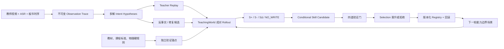

# Board2Skill-Opt v2：从教师示范到可验证、可进化的教学策略

> 状态：方法契约已冻结第一版；研究结果仍为 `TBD`
> 更新：2026-08-11
> 当前范围：高中物理受力分析试点；教师单向录播、无真实学生
> 核心原则：教师是高价值示范者，不是永远正确的策略 oracle

## 1. 这次升级解决什么问题

旧链路是：

```text
视频 / ASR / 关键帧
→ 模型分析课堂
→ 一次性生成 Teaching Skill
→ 直接打包为 valid Skill
```

它存在三个结构性问题：

1. **事实和设计混在一起。** 视频能证明教师做了什么，但不能直接证明教师为什么这样做、学生是否学会，以及这条路径是不是最优。
2. **无学生视频会诱发补写。** 旧输出结构要求填写学生回应、检查和补救，构建器又会给缺字段补默认内容，容易把建议写成课堂事实。
3. **最后一次生成被当成最终版本。** 缺少反事实比较、独立选择集、最差学生组约束、拒绝缓冲和回滚记录。

新版主张因此改为：

> 教师视频提供可追溯的教学先验；受控 TeachingWorld 暴露策略边界；成功、失败与部分成功轨迹形成类型化经验；候选 Skill 只有在独立选择集通过结构、证据、可执行和教学四道门后才晋升。

## 2. 新方法总览



这条链路中的证据职责固定为：

- **教师视频**：证明“教师实际做了什么”。
- **教材与学科规则**：验证知识、公式、图形和适用条件是否正确。
- **受控 Rollout**：比较在相同学生状态下哪条教学路径更有效。
- **selection 集**：决定候选是否晋升。
- **locked test**：只报告冻结版本的泛化表现，绝不反向修改 Skill。

## 3. 五层不可混合对象

### 3.1 `ObservationTrace`：不可变事实

只记录时间范围内直接可见或可听的教师动作、板书变化和话语，不记录“学生理解了”“学生恍然大悟”等视频中不存在的事实。每条观察必须绑定来源 ID、时间戳、证据引用和内容哈希。

无学生录播中：

- `learner_observation` 必须为 `null`；
- “学生可能混淆……”只能进入教师预判或意图假设；
- 观察记录一旦生成不能原地改写，只能生成新的修订 artifact。

### 3.2 `IntentHypothesis`：允许多解的教学解释

同一教师动作可以有多个解释，例如“先画系统边界”可能是为了减少内外力混淆，也可能只是整理题面。解释必须指回 Observation，并保存替代组、置信度和人工状态；不能把最高置信假设覆盖为观察事实。

### 3.3 `TypedExperience`：成功、失败和比较经验

经验库区分：

- `fact`：教材、规则或人工核验事实；
- `episode`：一次教师或 Agent 教学过程；
- `strategy_success`：在特定上下文可复现成功；
- `strategy_failure`：在特定上下文失败及主因；
- `strategy_comparison`：相同前缀下两条策略的成对比较；
- `validation`：独立验证记录。

允许 `NO_WRITE`。原始运行轨迹仍保存，但下列内容不得进入可复用经验库：重复经验、基础设施故障、裁判不确定、证据缺失、答案泄漏、未脱敏真实日志，以及没有稳定成对差异的单次结果。

### 3.4 `ConditionalTeachingSkillVersion`：条件化策略

一个 Skill 不再是一段通用话术，而是不可变版本，至少包含：

- 适用条件、禁用条件与不确定时的处理方式；
- 一个或多个策略变体；
- 有序教师动作与可执行黑板动作；
- 可观察学习检查；
- 不同于失败解释的补救动作；
- 教师示范、反事实、修复和经验来源；
- 预期效果是 `inferred` 还是已经 `validated`；
- 父版本、验证记录、拒绝记录和回滚点。

教师风格是后置 `Style Adapter`，不得覆盖核心物理正确性、检查和拒绝条件。

### 3.5 `SkillValidationEvent`：独立追加的验证账本

验证记录独立于 SkillVersion，保存数据集版本、split、模型与 Prompt 指纹、预算、seed、四道门、分组指标和最终决策。它只能追加，不能为了让候选通过而修改历史结果。

## 4. 优化算法

### S0：双源初始化

教师视频产生 Observation 和 Teacher Replay；教材、课程标准、规范受力图与物理规则形成独立验证锚点。验证锚点不能看到当前目标答案，防止“用答案验证答案”。

### S1：生成多个意图和策略候选

每组关键 Observation 至少保留一个 Teacher Replay，并允许产生：

- 更短、更清晰的反事实路径；
- 修复原路径中知识、顺序或板书错误的路径；
- 针对不同学生状态的分裂策略；
- 证据不足时的 `abstain` 或 `ask`。

教师路径不会被删除；它始终作为可审计基线。

### S2：相同前缀的成对 Rollout

在相同问题、学生隐藏状态、可见回答、对话前缀、黑板状态和 seed 上比较：

- Teacher Replay vs 反事实候选；
- retrieve vs `NO_RETRIEVE`；
- 当前 Skill vs 修复版本；
- 单教师策略 vs 合并策略。

学生隐藏状态由专家定义的知识状态机控制，LLM 只负责把状态语言化，不能自行改写隐藏真值。

### S3：失败诊断

每个失败标一个最早主因，可附加次因：

1. `knowledge_gap`：物理知识或适用条件错误；
2. `teaching_policy_gap`：诊断、顺序、提示、补救或检查不当；
3. `routing_gap`：错误检索、错误不检索或 Skill 不适用；
4. `student_model_gap`：虚构学生状态或状态转移不符合配置；
5. `board_tool_bug`：策略正确但黑板图、公式、布局或调用错误；
6. `verifier_uncertain`：证据不足或裁判无法可靠判断；
7. `answer_leakage`：引导阶段提前泄露答案；
8. `unsupported_claim`：说出了没有证据的学生状态或教学效果。

`verifier_uncertain` 进入人工复核，不自动变成正例或负例。

### S4：类型化经验写入与候选编辑

只有通过来源检查、可复现检查和信息增量检查的轨迹才能写入 `S+ / S- / SΔ`。优化器只允许有限编辑：调整适用条件、替换动作、增加补救、分裂变体、合并重复策略或增加拒绝条件；不能无界重写整个 Skill。

### S5：四道硬门

| Gate | 必须回答的问题 | 典型硬失败 |
|---|---|---|
| Schema | 对象完整、引用有效、依赖可重放吗？ | 缺字段、悬空 ID、循环依赖 |
| Evidence | 教师行为有时间戳、物理主张有锚点吗？ | 虚构学生回应、无依据效果、答案进入候选上下文 |
| Executable | 工具、公式和黑板程序能正确执行吗？ | 箭头方向错、力的对象错、分量被画成新力、运行失败 |
| Pedagogical | 策略适用、补救不同、检查可观察且不泄露答案吗？ | 未诊断先纠错、机械重复、假检查、直接给完整答案 |

“SVG 能渲染”不等于 Executable 通过；受力对象、系统边界、箭头方向、标签归属和力/分量身份都必须正确。

### S6：严格晋升、拒绝和回滚

候选只用 train 轨迹生成，只在 selection 集与 incumbent 做同场景同 seed 配对。首个工程 Pilot 的冻结规则为：

- 四道硬门全部通过；
- selection `Episode Success` 绝对提升至少 `5pp`；
- 两个 selection 问题家族都为正向；
- 最差学生状态退化不超过 `2pp`；
- Unsupported Student-state Claim Rate 不升；
- Answer Leakage 不升；
- 关键物理错误和关键图示错误均为 `0`；
- 平分即拒绝，不采用“最后一次修改就是最终版本”。

通过后只原子更新 active pointer，旧版本和 rejected buffer 均保留。locked test 只能评测冻结 winner，不能触发编辑或晋升。

## 5. 24 场景物理 Pilot

采用 `8 个问题家族 × 3 个受控学生状态`。同一家族的三种状态必须属于同一个 split，禁止按单条场景随机切分。

学生状态：

- `U`：不确定，尚未诊断具体知识缺口；
- `M`：持有明确典型误解；
- `P`：概念基本正确，但图示、边界或近迁移执行失败。

| Split | 问题家族 | 场景数 |
|---|---|---:|
| Train | 水平面受力清单、斜面力分解、接触系统边界、作用反作用与平衡力 | 12 |
| Selection | 电梯视重、叠放物体摩擦 | 6 |
| Locked test | 斜面上的斜向拉力、桌面滑轮连接体 | 6 |

每条场景必须冻结：可见学生消息、隐藏知识状态、误解代码、初始黑板、允许动作、必需概念、禁止主张、答案泄漏边界、允许的下一动作集合、学习检查、近迁移题和学科锚点。

## 6. 基线与指标

主比较固定为：

1. `Base Tutor`：无 Skill；
2. `Teacher Replay`：只执行教师原路径；
3. `Resource2Skill`：一次性多模态蒸馏；
4. `Fixed SkillOpt`：固定场景上的有限文本优化；
5. `Board2Skill-Opt`：完整方法。

诊断消融包括 always-retrieve、no-retrieve、no-write 和 teacher-only/no external anchor。

主指标不是单一模糊总分，而是硬约束后的 Episode Success：

```text
physics_correct
AND applicable_teaching_action
AND valid_blackboard_if_required
AND observable_learning_check
AND no_answer_leakage
AND no_unsupported_student_state_claim
```

同时报告 Physics Correctness、Diagram Semantic Error Rate、Diagnosis Accuracy、Remediation Success、Near-transfer Accuracy、Invalid Skill Retrieval、NO_RETRIEVE Accuracy、paired Retrieval Utility、Memory Write Precision、token、工具调用、延迟、成本，以及按问题家族和学生状态的 worst-group。

24 场景只用于工程 `Go / Fix / Pivot`，不能声称真实学生学习增益或论文级显著性。论文主证据仍需扩大独立问题家族、教师和视频，并按问题家族/教师聚类报告 95% 置信区间。

## 7. 分步实施

### P0-A：研究契约（本轮已完成第一片）

- [x] 新增 `board2skill-opt-v2` TypeScript 契约；
- [x] 分开 Observation、Hypothesis、Experience、PolicyVersion 和 PromotionRecord；
- [x] 实现引用、相对路径、无学生视频、`NO_WRITE`、四道门、selection-only promotion、最差组和泄漏门槛验证；
- [x] 增加 19 个单元测试，覆盖嵌套字段、非法引用、UNC/URI/编码穿越、非有限时间与指标、矛盾 Gate、状态机、验证悬空引用、问题家族去重、关键错误计数、`NO_WRITE` 污染和 locked-test 绕过；
- [ ] 把当前 v1 课堂分析接到显式 adapter；
- [ ] 移除 builder 的事实性默认补写和无条件 `valid: true`。

实现位置：

- `packages/contracts/src/board2skill.ts`
- `packages/contracts/src/board2skill.test.ts`

### P0-B：24 场景与学科锚点（下一步）

1. 写出 24 条场景配置和 schema；
2. 为每个问题家族建立物理硬规则、规范受力图语义和答案泄漏边界；
3. 双人检查场景的学生状态、允许动作集合和近迁移题；
4. 冻结 `train / selection / locked_test` manifest 与哈希。

### P0-C：Observation adapter 与首批标注

1. 从现有 6 条公开视频中选 6–10 个关键片段；
2. 保存原 ASR、板书事件和教师动作，不填学生实际回应；
3. 对同一动作保留多个 Intent Hypothesis；
4. 生成 Teacher Replay，暂不自动晋升。

### P0-D：最小成对 Rollout

1. 只在 12 个 train 场景生成反事实候选；
2. 运行 Teacher Replay vs 候选、retrieve vs no-retrieve；
3. 写入可复现的 `S+ / S- / SΔ`，其余 `NO_WRITE`；
4. 在 6 个 selection 场景执行四门和晋升；
5. 晋升规则通过后才运行 6 个 locked test。

### P1：动态进化

只有固定 Pilot 跑通后，才加入能力缺口驱动的新场景、Skill 分裂/合并、主动路由、shadow/canary 和线上日志离线回放。真实会话永远只产生候选经验，不能在线直接修改 active Skill。

## 8. 当前 Gate 状态

| Gate | 状态 | 说明 |
|---|---|---|
| 方法边界 | PASS | 已明确教师示范不等于最优策略 |
| 契约第一片 | PASS | TypeScript 类型、运行时验证和定向测试已通过 |
| 旧链路接入 | NOT STARTED | 当前产品仍在读取 v1 Skill，本轮未切换生产路径 |
| 24 场景 | DESIGNED, NOT AUTHORED | 已冻结家族与切分，尚未逐条写题和学科 rubric |
| Observation 标注 | NOT STARTED | 现有一次性分析不能当 v2 gold |
| 实验结果 | TBD | 尚未运行任何新版对比，不报告提升 |
