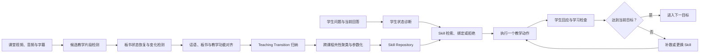

# Classroom2Tutor 研究与实现路线图

> 状态：Working Draft  
> 更新日期：2026-08-05  
> 当前阶段：研究问题收敛与 P0 实验闭环修复  
> 第一目标：ACL / EMNLP Main Conference 级别的方法与评测工作  
> 回退路径：Findings；若更偏教育实证，则考虑 AIED / EDM Main；若更偏视频方法，则考虑 ACM Multimedia Main

## 1. 文档目的

本文档是项目后续实现、实验和论文写作的唯一主路线图。每次开发优先回答以下问题：

1. 这个改动对应哪条论文 Claim？
2. 它解决了哪个明确的研究瓶颈？
3. 它由哪个对照实验或消融实验验证？
4. 如果该实验不成立，项目应当收缩到什么结论？

没有明确 Claim、实验或阶段出口的功能暂不实现。

## 2. 研究目标

### 2.1 暂定题目

**Classroom2Tutor: Distilling Evidence-Grounded Teaching Skills from Classroom Videos for Multimodal Tutoring Agents**

中文工作名：

**Classroom2Tutor：从真实课堂视频中蒸馏证据可追溯的多模态教学策略**

### 2.2 一句话问题定义

给定多节真实课堂视频、字幕和板书变化，自动蒸馏可被学生侧 Agent 执行的状态条件化教学策略，并验证这些策略能否在同等推理预算下优于裸模型、原始资源检索和纯文本 Skill，尤其是在未见课程、未见教师和相邻知识点上的迁移能力。

### 2.3 核心研究假设

课堂中的可迁移教学能力不是一段静态说明，而是一个带条件和反馈的教学状态转换：

```text
学生困难/错误状态
        ↓
选择教学动作与表征方式
        ↓
产生可观察的学生回应
        ↓
检查是否达到当前学习目标
        ↓
继续、补救、更换策略或拒绝执行
```

视频的独特价值不只是提供图片，而是提供教师话语、板书变化、示范动作和教学意图之间的时序关系。

## 3. 论文贡献边界

### 3.1 计划主张的贡献

1. **新任务：Classroom-to-Tutor Skill Transfer**  
   从课堂视频中学习可复用教学策略，并在学生侧多轮 Agent 中执行和评测。

2. **新表示：Teaching Transition**  
   将 Skill 表示为“触发条件—教学动作—预期回应—学习检查—补救—拒绝条件”，而不是一段教案或提示词。

3. **新多模态机制：Temporal Board-State Grounding**  
   对板书状态变化及其教学功能进行建模，而不是只抽取静态关键帧。

4. **新执行机制：Evidence-Grounded Skill Binding**  
   根据学生当前状态绑定教学策略参数，在多轮交互中逐步执行、检查和补救。

5. **新评测：从资源蒸馏到学习结果的完整链路**  
   在同等预算下比较裸模型、原始 RAG、文本 Skill、静态多模态 Skill 和完整时序 Skill，并测试跨教师、跨课程与跨知识点迁移。

### 3.2 不计划作为主要贡献的内容

- 通用视频下载和转写；
- 通用 Skill 文件格式；
- Pi Agent 本身；
- QA 前端和项目管理界面；
- 长期记忆或三层记忆；
- 在线 Skill 自动生长；
- 为所有 Skill 自动生成 SVG；
- 单纯把已有多模态 Skill 方法迁移到教育场景。

这些内容可以作为系统实现，但不能代替论文贡献。

## 4. 与已有工作的区别

| 研究线 | 代表工作 | 已经覆盖 | 本项目必须留下的差异 |
| --- | --- | --- | --- |
| 多模态资源到 Skill | [RESOURCE2SKILL](https://arxiv.org/abs/2606.29538) | 从视频、文章、代码等资源生成可执行 Skill | 教学状态语义、学生反馈闭环、课堂到 Tutor 的迁移评测 |
| Guide / Trajectory 到 Skill | [MMG2Skill](https://arxiv.org/abs/2606.01993)、[MMSkills](https://arxiv.org/abs/2605.13527) | 结构化 Skill、自我修订、视觉状态卡 | 从真实教师行为中学习教学策略，而非通用 GUI / 游戏操作策略 |
| 教学视频理解 | [PedagogyBench](https://aclanthology.org/2026.findings-acl.614/)、[SciIBI](https://arxiv.org/abs/2602.18466) | 教学视频分段、高阶教学理解、课堂实践识别 | 将理解结果编译为可执行策略，并评测下游学生学习 |
| 时序视频推理 | [VideoMathQA](https://iclr.cc/virtual/2026/poster/10009154) | 数学视频中的跨模态、跨时间推理 | 板书状态转换与教学功能，而非只回答视频理解问题 |
| 多轮教学 Agent | [ScaffoldLM](https://aclanthology.org/2026.acl-long.325/) | 学习者状态、教学计划和多轮控制 | 策略来自真实课堂证据，并测试跨课堂迁移 |
| 教学评测 | [MathTutorBench](https://aclanthology.org/2025.emnlp-main.11/)、[MRBench](https://aclanthology.org/2025.naacl-long.57/)、[MMTutorBench](https://aclanthology.org/2026.acl-long.1068/) | 教学质量、诊断、引导和多模态数学辅导评测 | 资源蒸馏方式、教学策略执行与学习结果之间的因果链路 |

当前不使用“首个”“首次”等绝对表述。正式投稿前需要重新检索最新工作并完成逐项 novelty audit。

## 5. 研究问题与 Claim-Evidence 对齐

### 5.1 研究问题

- **RQ1：结构化 Skill 是否优于原始课堂资源检索？**
- **RQ2：时序板书是否优于纯文本和静态关键帧？**
- **RQ3：蒸馏出的教学策略能否迁移到未见课程、未见教师和相邻知识点？**
- **RQ4：多轮执行闭环是否优于一次性 Skill-enhanced QA？**
- **RQ5：改进是否反映在学生后续表现，而不仅是 LLM Judge 对回答风格的偏好？**

### 5.2 Claim-Evidence Matrix

| Claim | 审稿人会问什么 | 所需证据 | 主要基线 | 主要指标 | 状态 |
| --- | --- | --- | --- | --- | --- |
| Teaching Transition 比非结构化 Skill 更有效 | 是不是换了一个 Prompt？ | 结构化 Skill 与同内容自由文本 Skill 的配对实验 | Text Prompt、Text Skill、Full Skill | 诊断、动作选择、补救成功率 | Planned |
| Skill 优于原始资源 RAG | 为什么不直接检索字幕和图片？ | 同模型、同 token、同图像预算的 RAG 对照 | Transcript RAG、Raw Multimodal RAG | 学习增益、迁移、成本 | Planned |
| 时序板书提供独立价值 | 静态截图是否已经足够？ | Text、Static Frames、Temporal Board States 消融 | Text Skill、Static MM Skill | 板书完整率、视觉题表现、迁移 | Planned |
| 多轮闭环优于一次性回答 | 是否只是回答更长、更像老师？ | One-shot 与 diagnose-act-check-remediate 对照 | One-shot Skill QA | 多轮完成、补救、泄露率 | Planned |
| 策略能够跨课堂迁移 | 是否记住了课程内容？ | 未见教师、未见课程和跨知识点划分 | Raw RAG、Text Skill | held-out performance、drop | Planned |
| Agent 改善学习而非只改善风格 | LLM Judge 是否自嗨？ | 可验证题目、学生模拟器、少量教师校准 | Base、各 Skill 组 | 新题正确率、延迟迁移、校准一致性 | Planned |

## 6. 方法总览



## 7. Teaching Transition 数据结构

### 7.1 建议 Schema

```yaml
skill_id: physics-displacement-path-contrast
version: 1

trigger:
  subject: physics
  concept: displacement
  misconception: path_length_equals_displacement
  evidence_signals:
    - student_adds_all_segments
    - student_ignores_direction

preconditions:
  required_knowledge:
    - start_and_end_position
    - direction

teaching_action:
  move: construct_return_to_origin_counterexample
  representation: temporal_board
  content_template: draw_path_and_start_end_arrow
  parameters:
    - start_point
    - end_point
    - path_segments

expected_response:
  observable: student_states_nonzero_path_but_zero_displacement

learning_check:
  task_template: change_path_and_recompute
  success_criteria:
    - correct_path_length
    - correct_displacement_magnitude
    - correct_direction

remediation:
  condition: student_still_conflates_path_and_displacement
  action: separately_highlight_path_and_displacement_arrow

abstain_when:
  - missing_prerequisite_geometry
  - question_is_only_formula_calculation

evidence:
  - video_id: TBD
    start_time: TBD
    end_time: TBD
    transcript_span: TBD
    board_state_ids: []

confidence:
  source_support: TBD
  cross_lesson_support: TBD
```

### 7.2 强制约束

每个有效 Skill 必须满足：

- 有明确的学生困难或适用触发条件；
- 教学动作能够由 Agent 执行；
- 预期回应能够被观察和判断；
- 至少有一个学习检查；
- 至少有一个补救分支；
- 有不适用或拒绝条件；
- 有可追溯的课堂证据；
- 不把模型猜测的学生反应伪装成视频事实。

## 8. Temporal Board-State 表示

### 8.1 从关键帧升级为状态变化

当前 V1 的提示词、镜头变化和周期采样保留为候选生成器，不再直接视为最终关键帧选择方法。

建议管线：

```text
候选时间点生成
→ 板书 / PPT / 实验区域检测
→ OCR 与视觉对象提取
→ 相邻帧差分
→ 稳定状态聚类
→ 与字幕和教师动作对齐
→ 选择教学状态转折点
```

### 8.2 Board Delta Schema

```json
{
  "before_state": "B02",
  "operation": "add_arrow",
  "objects": ["start_A", "end_B"],
  "after_state": "B03",
  "aligned_utterance": "只看起点和终点",
  "pedagogical_function": "contrast_path_and_displacement",
  "confidence": "TBD"
}
```

### 8.3 多课程共性蒸馏原则

不按“画了什么”聚类，而按“为什么这样画”聚类：

- 具体对象：小车、操场、斜面、电荷；
- 表征动作：增加箭头、切换坐标、隐藏干扰、逐步补全；
- 教学功能：概念对比、暴露错误、建立模型、降低认知负荷、形成性检查。

共性 Skill 需要至少两个相互独立的课堂证据支持；仅在单课出现的策略保留为 lesson-specific pattern，不直接提升为通用 Skill。

## 9. 教学 Agent 执行协议

### 9.1 Episode State

```json
{
  "target_concept": "TBD",
  "suspected_misconception": "TBD",
  "mastery_state": "unknown|struggling|partial|mastered",
  "last_student_response": "TBD",
  "active_skill_id": "TBD",
  "current_step": 0,
  "evidence_used": [],
  "next_action": "diagnose|explain|ask|render|remediate|abstain"
}
```

### 9.2 执行规则

1. 每轮只执行一个主要教学动作；
2. 未诊断学生困难前，不直接倾倒完整答案；
3. 需要视觉表征时必须真实调用视觉证据或受限渲染工具；
4. 每个教学子目标必须以学生可回答的检查结束；
5. 学生失败时优先执行 Skill 的补救分支；
6. Skill 不适用时允许 abstain 或重新检索；
7. 不需要跨会话长期记忆，只维护当前 episode 状态；
8. 所有 Skill 调用、视觉调用、回退和拒绝都必须记录。

## 10. 数据与 Benchmark 计划

### 10.1 Pilot 数据

目标：快速判断研究机制是否有信号，而不是追求数据规模。

- 3 个物理单元；
- 每个单元约 4 节课堂；
- 尽量包含不同教师或不同教学风格；
- 60～100 个学生困难场景；
- 约 30 个小规模人工审查的 Teaching Transition gold set；
- 约 10 个板书时序片段 gold set。

建议优先单元：

1. 运动学概念与图像；
2. 力学与受力图；
3. 电学、电路或实验。

### 10.2 正式数据目标

Pilot 有稳定信号后再扩展：

- 30～50 节以上课堂作为第一版正式规模目标；
- 5 个以上知识单元；
- 150～300 个以上教学场景；
- 数量不是唯一标准，教师、知识点、表征形式和困难类型的多样性更重要。

### 10.3 数据划分

| Split | 训练是否见过知识点 | 训练是否见过教师 | 目的 |
| --- | --- | --- | --- |
| In-domain | 是 | 是 | 基本可用性 |
| Unseen-teacher | 是 | 否 | 跨教师迁移 |
| Unseen-lesson | 相邻知识点可见 | 可见或不可见 | 跨课程迁移 |
| Cross-topic | 否 | 可见或不可见 | 共性教学策略迁移 |
| Hard / failure | 混合 | 混合 | 错误分析和边界分析 |

### 10.4 防泄漏要求

- 同一视频的相邻片段不能跨训练和测试；
- 同一教师的高度相似课程不能同时出现在 unseen-teacher 两侧；
- 生成学生问题时不能把测试答案写入 Skill；
- 用于裁判的模型不能读取方法身份；
- 自动生成数据必须保留生成模型、Prompt 版本和验证记录。

### 10.5 人工验证策略

不要求全量人工标注，采用“小规模 gold set + 抽样校准”：

- 对约 10% 的样本进行物理教师或高质量专家审查；
- 抽查证据是否支持教学动作；
- 校准自动裁判与教师判断的一致性；
- 对主实验中的代表案例和失败案例进行复核；
- 若无法获得两名教师，则至少保留一名教师审查与双次盲审协议，并明确局限。

## 11. Baseline Matrix

| ID | 方法 | 输入资源 | 为什么必须包含 | 公平性约束 |
| --- | --- | --- | --- | --- |
| M0 | Base LLM | 学生问题与对话 | 简单 sanity baseline | 相同基础模型和输出预算 |
| M1 | Transcript RAG | 原始字幕片段 | 验证 Skill 是否优于直接文本检索 | 与 Skill 组匹配 token 预算 |
| M2 | Raw Multimodal RAG | 字幕 + 原始关键帧 | 验证结构化多模态表示的必要性 | 匹配图像数量和分辨率 |
| M3 | Text Skill | 纯文本 Teaching Transition | 测量结构化文本 Skill 增益 | 不提供视频帧或板书状态 |
| M4 | Static Multimodal Skill | 文本 Skill + 静态关键帧 | 测量静态视觉增益 | 与 M5 匹配视觉数量 |
| M5 | Full Classroom2Tutor | Text Skill + Temporal Board-State + 执行闭环 | 完整方法 | 与其他组匹配模型和最大推理预算 |
| Oracle | Expert-selected Skill | 专家选择最适用 Skill | 诊断 Skill 路由上限 | 只在小规模测试使用 |

至少在两个基础模型上复现实验，避免结论只依赖单一模型或中转 API 行为。

## 12. 评测指标

### 12.1 蒸馏与证据质量

- Evidence Grounding Precision / Recall；
- Teaching Transition 字段完整率；
- 教学动作与视频证据一致性；
- Board-State 变化检测准确率；
- 板书操作顺序恢复率；
- 跨课程证据支持数；
- Skill 冗余率；
- 无证据陈述率；
- 不适用时的拒绝准确率。

### 12.2 Agent 教学质量

- 学生困难诊断准确率；
- 下一教学动作质量；
- 过早泄露答案率；
- 学习检查完成率；
- 错误后的补救成功率；
- 多轮教学完成率；
- Skill 选择准确率；
- 视觉工具实际调用率；
- 多模态请求回退率。

### 12.3 学习结果

- 当前题最终正确率；
- 新题迁移正确率；
- 保持相同概念但改变表征后的正确率；
- 可选的延迟测验正确率；
- 模拟学生从错误状态转入掌握状态的比例；
- 真实学生或教师评测阶段的学习增益。

### 12.4 效率与系统指标

- 输入和输出 token；
- 输入图像数量；
- 端到端延迟；
- 单 episode API 成本；
- 视觉分析和渲染失败率；
- Skill 检索和绑定时间；
- 不同视频长度下的处理开销。

### 12.5 自动裁判要求

- 裁判输入必须包含真实展示给学生的全部内容；
- 结构化 `learning_check` 不能被裁判遗漏；
- 裁判看不到 A/B 身份；
- 至少使用一种非生成式客观指标；
- 用少量教师标注报告裁判一致性；
- 报告裁判偏差、失败类型和模型同源风险。

## 13. 主实验与结果表模板

### 13.1 主结果

| 方法 | 诊断准确率 ↑ | 教学动作质量 ↑ | 补救成功率 ↑ | 新题迁移 ↑ | 答案泄露率 ↓ | 多模态回退率 ↓ | 成本 ↓ |
| --- | ---: | ---: | ---: | ---: | ---: | ---: | ---: |
| Base LLM | TBD | TBD | TBD | TBD | TBD | N/A | TBD |
| Transcript RAG | TBD | TBD | TBD | TBD | TBD | N/A | TBD |
| Raw Multimodal RAG | TBD | TBD | TBD | TBD | TBD | TBD | TBD |
| Text Skill | TBD | TBD | TBD | TBD | TBD | N/A | TBD |
| Static Multimodal Skill | TBD | TBD | TBD | TBD | TBD | TBD | TBD |
| Full Classroom2Tutor | TBD | TBD | TBD | TBD | TBD | TBD | TBD |

### 13.2 迁移实验

| 方法 | In-domain ↑ | Unseen-teacher ↑ | Unseen-lesson ↑ | Cross-topic ↑ | 最大性能下降 ↓ |
| --- | ---: | ---: | ---: | ---: | ---: |
| Transcript RAG | TBD | TBD | TBD | TBD | TBD |
| Text Skill | TBD | TBD | TBD | TBD | TBD |
| Static Multimodal Skill | TBD | TBD | TBD | TBD | TBD |
| Full Classroom2Tutor | TBD | TBD | TBD | TBD | TBD |

所有 `TBD` 必须由真实运行产生，不得根据预期、示例或单次观察填入。

## 14. 消融实验

| 变体 | 移除或替换 | 验证的机制 | 失败时的解释 |
| --- | --- | --- | --- |
| Full | 无 | 完整系统 | 主结果参考 |
| w/o Temporal Board-State | 改为静态关键帧 | 板书时序是否必要 | 若无下降，不能把时序作为主要贡献 |
| w/o Visual Evidence | 只保留文本 Skill | 多模态是否提供独立价值 | 若无下降，应收缩多模态 Claim |
| w/o Student-State Trigger | 仅按问题相似度检索 | 状态条件化是否必要 | 若无下降，触发机制可能只是复杂化 |
| w/o Learning Check | 删除检查和补救 | 教学闭环是否必要 | 若无下降，当前任务可能只测回答质量 |
| w/o Evidence Grounding | 删除来源证据 | 证据约束是否降低幻觉 | 若无下降，需要重新设计 grounding 指标 |
| Raw Resource Replacement | 用原始 RAG 替代 Skill | 蒸馏结构是否必要 | 若无下降，核心蒸馏贡献不成立 |
| Generic Skill Schema | 替换为自由文本指导 | Teaching Transition 是否必要 | 若无下降，新 Schema 没有实质作用 |

## 15. 鲁棒性、失败与效率实验

### 15.1 鲁棒性

- 字幕存在 ASR 错误；
- 板书遮挡、低清晰度和镜头切换；
- 同一概念采用不同教师表征；
- 学生回答含糊、不完整或自相矛盾；
- Skill 库缺失相关策略；
- 问题只需要直接计算，不需要复杂教学策略；
- 视觉工具不可用或 API 拒绝图像输入。

### 15.2 失败类型

- 错误诊断学生困难；
- 选择泛化过度的 Skill；
- 引用了与当前问题无关的课堂证据；
- 把板书内容变化误判为教学策略；
- 教学动作正确但检查无效；
- 学生失败后重复原解释而不补救；
- 过早泄露完整答案；
- 请求多模态但实际回退到文本；
- LLM Judge 与客观学习结果不一致。

### 15.3 统计与报告

- 使用配对实验；
- 报告置信区间而不只报告均值；
- 对随机生成或模型采样运行多个种子；
- 按知识单元、错误类型和模态分别报告；
- 报告负结果和失败案例；
- 报告模型版本、Prompt 版本和完整推理预算。

## 16. 分阶段实现路线

### Phase 0：冻结 V1 与修复实验闭环

预计时间：3～5 天。

#### 任务

- [ ] 给当前系统标记 V1 baseline；
- [ ] 统一 `answer`、`learning_check`、`student_response`、`assessment` 和 `next_action`；
- [ ] 修复裁判遗漏结构化学习检查的问题；
- [ ] 记录 requested / actual modality；
- [ ] 记录 visual count、tool calls 和 fallback；
- [ ] 多模态回退样本不得计入有效多模态结果；
- [ ] 固定 Base、Text Skill、Multimodal Skill 三个最小组；
- [ ] 建立 20～30 题冒烟测试集；
- [ ] 为所有实验保存模型、Prompt 和配置版本。

#### Gate P0

只有全部满足才进入 Phase 1：

- 同一题能够运行全部最小对照组；
- 学习检查真实展示且进入下一轮；
- 裁判读取学生真正看到的内容；
- 多模态是否真实执行完全可审计；
- API 回退不再被误记为多模态成功；
- 冒烟测试能够重复运行并保存结果。

### Phase 1：Teaching Transition Schema 与小型 Gold Set

预计时间：1 周。

#### 任务

- [ ] 实现 Teaching Transition Schema；
- [ ] 从 3 个物理单元选择约 30 个代表片段；
- [ ] 建立约 30 个经审查的策略实例；
- [ ] 区分视频事实、模型推断和未知字段；
- [ ] 增加适用条件、补救和 abstain；
- [ ] 测试自由文本 Skill 与结构化 Skill 的差异。

#### Gate P1

- 每个 gold Skill 有触发、动作、检查、补救和证据；
- 自动蒸馏能够输出合法 Schema；
- 无证据的学生状态不会被写成视频事实；
- 结构化 Skill 至少在 pilot 中显示出可执行性优势，否则先修改 Schema。

### Phase 2：Temporal Board-State

预计时间：1～2 周。

#### 任务

- [ ] 保留 V1 启发式作为候选帧生成；
- [ ] 识别板书、PPT、实验和图示区域；
- [ ] 提取 OCR 与视觉对象；
- [ ] 计算相邻状态差分；
- [ ] 聚类稳定板书状态；
- [ ] 对齐字幕、视觉变化和教学功能；
- [ ] 建立约 10 个时序片段 gold set；
- [ ] 输出可审计的 Board Delta。

#### Gate P2

- 能恢复主要板书状态顺序；
- 能识别关键新增、删除或修改；
- 能将变化对齐到教师话语；
- 时序表示相对静态关键帧在至少一个核心任务上提供稳定信息增益；
- 若无增益，停止扩大时序模块并收缩多模态 Claim。

### Phase 3：多轮 Skill Agent

预计时间：1 周。

#### 任务

- [ ] 实现 episode state；
- [ ] 实现 diagnose、retrieve、bind、act、check、remediate、abstain；
- [ ] 一轮只执行一个主要教学动作；
- [ ] 接收学生回应并更新状态；
- [ ] 接入受限视觉证据和绘图工具；
- [ ] 记录完整 Agent trajectory；
- [ ] 增加 one-shot baseline。

#### Gate P3

- Agent 可以完成至少两轮教学；
- 学生答错后能够进入补救而不是重复原回答；
- Skill 不适用时能够拒绝或更换；
- 所有状态变化和工具调用可追踪；
- one-shot 与 closed-loop 可以在相同任务上公平比较。

### Phase 4：统一实验 Harness

预计时间：1 周。

#### 任务

- [ ] 实现 M0～M5 六组方法；
- [ ] 匹配模型、token、图像和最大轮数；
- [ ] 建立固定数据划分；
- [ ] 接入客观题目评分；
- [ ] 接入盲化 LLM Judge；
- [ ] 接入少量人工校准数据；
- [ ] 记录成本、延迟和失败率；
- [ ] 支持多个模型和多个种子批量运行。

#### Gate P4

- 同一输入能够运行所有方法；
- 实验身份对裁判不可见；
- 预算差异能够被报告；
- 结果文件包含完整复现实验配置；
- 任意失败或回退都有明确状态，不静默降级。

### Phase 5：Pilot 实验与 Go / Pivot 决策

预计时间：1 周。

#### 任务

- [ ] 运行主对照；
- [ ] 运行最关键的三个消融；
- [ ] 分析未见教师和未见课程；
- [ ] 检查 Judge 与客观指标一致性；
- [ ] 检查多模态真实调用率；
- [ ] 整理代表成功案例和失败案例。

#### Gate P5

继续扩大数据需要满足：

- Full Method 相对原始 RAG 的优势不是仅由更长输出造成；
- Text Skill 相对 Transcript RAG 至少在核心教学指标上有稳定正向信号；
- Temporal / Multimodal Skill 相对 Text Skill 至少在视觉依赖任务上有稳定正向信号；
- Closed-loop 相对 one-shot 在补救或迁移指标上有稳定正向信号；
- 信号能够跨不止一个模型或数据子集出现。

若不满足，先根据第 17 节收缩 Claim，不直接扩大数据。

### Phase 6：正式数据、主实验与论文

预计时间：2～4 周，取决于数据规模和 API 成本。

#### 任务

- [ ] 扩大课堂、知识点、教师和学生困难类型；
- [ ] 完成六组主实验；
- [ ] 完成全部关键消融；
- [ ] 完成鲁棒性、成本和失败分析；
- [ ] 完成人工抽样校准；
- [ ] 冻结数据和代码版本；
- [ ] 形成结果表和图；
- [ ] 按 Main Conference 标准起草论文；
- [ ] 投稿前重新做最新相关工作检索和完整性检查。

## 17. 停止与转向条件

| 观察 | 结论 | 下一步 |
| --- | --- | --- |
| Text Skill ≈ Transcript RAG | 蒸馏没有增加有效结构 | 重做 Teaching Transition，暂不扩大数据 |
| Multimodal Skill ≈ Text Skill | 视觉没有独立价值或没有被正确表示 | 检查视觉依赖任务；仍无增益则收缩多模态 Claim |
| Temporal Board ≈ Static Frames | 时序机制不成立 | 保留静态多模态，把时序降为失败分析 |
| Closed-loop ≈ One-shot | 当前任务没有测到教学闭环 | 改为真正需要学生回应和补救的任务 |
| LLM Judge 上升、客观迁移不变 | 只改善了回答风格 | 不声称学习效果，重做学习结果评测 |
| Seen 提升、Unseen 崩溃 | Skill 记住内容而非教学共性 | 强化参数化与跨课程证据约束 |
| Full ≈ Raw Multimodal RAG | Skill 编译没有必要 | 核心论文 Claim 不成立，转为课堂视频 Benchmark 或分析论文 |
| 数据或专家审查无法获得 | 无法支持强教育有效性结论 | 收缩为方法 / Benchmark 论文，并明确边界 |

## 18. 近期禁止事项

在 Gate P3 前，不做：

- [ ] QA UI 大改；
- [ ] 新的项目管理页面；
- [ ] 长期记忆；
- [ ] 多学科；
- [ ] 在线 Skill 获取；
- [ ] 新 Agent 框架迁移；
- [ ] 与论文 Claim 无关的通用工具；
- [ ] 全量数据处理；
- [ ] 论文正文写作。

## 19. 建议产物目录

以下目录在对应阶段开始时再创建，不在当前计划阶段提前生成空文件：

```text
research/
├── task_definition.md
├── teaching_transition.schema.json
├── board_delta.schema.json
├── claim_evidence_matrix.md
└── decision_log.md

benchmark/
├── pilot/
├── gold/
├── splits/
├── scenarios/
└── annotations/

experiments/
├── configs/
├── baselines/
├── runs/
├── reports/
└── failures/
```

## 20. 下一步唯一优先事项：P0

下一次实现从下面的顺序开始：

1. 冻结并标记 V1 baseline；
2. 修复学习检查、答案正文与裁判输入不一致；
3. 增加 requested / actual modality 和 fallback 审计；
4. 确保真正的多模态调用能够成功；
5. 建立第一批 20～30 个固定物理测试场景；
6. 跑通 Base、Text Skill、Multimodal Skill 三组最小实验；
7. Gate P0 通过后，再设计 Teaching Transition Schema 的代码改动。

不要同时开始 Temporal Board-State 或多轮 Agent。先保证实验链路可信，否则后面的改进无法判断是否有效。

## 21. 项目状态记录

| 日期 | 阶段 | 决策 | 证据 | 下一步 |
| --- | --- | --- | --- | --- |
| 2026-08-05 | Research planning | 按 Main Conference 标准设计，Findings 仅作回退 | 相关工作检索与当前 V1 A/B 审计 | 执行 Phase 0 |

## 22. 结果真实性声明

本文档只定义研究设计和执行关卡，没有生成任何实验结果。所有 `TBD` 必须来自真实运行、匹配协议的公开基线报告或经过验证的人工评测。不得把单个案例、模型自评、预期提升或失败回退样本写成论文结果。
