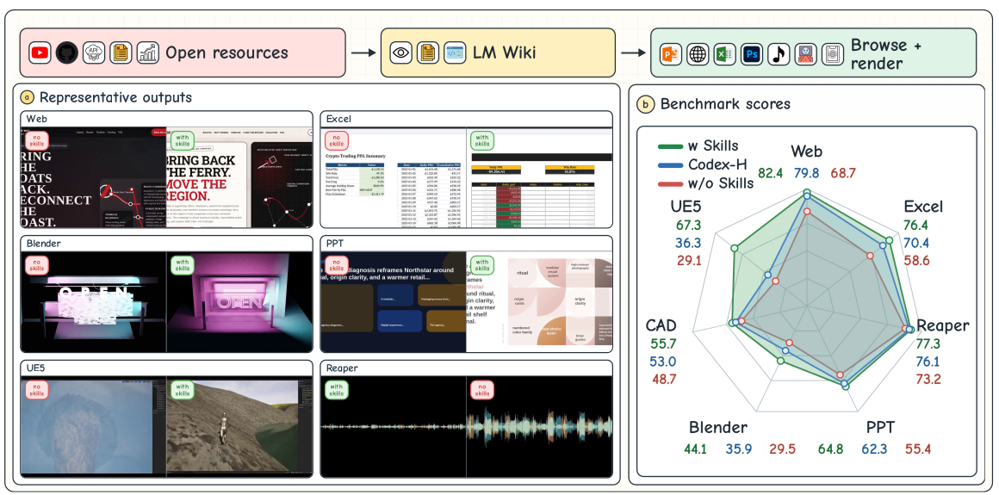
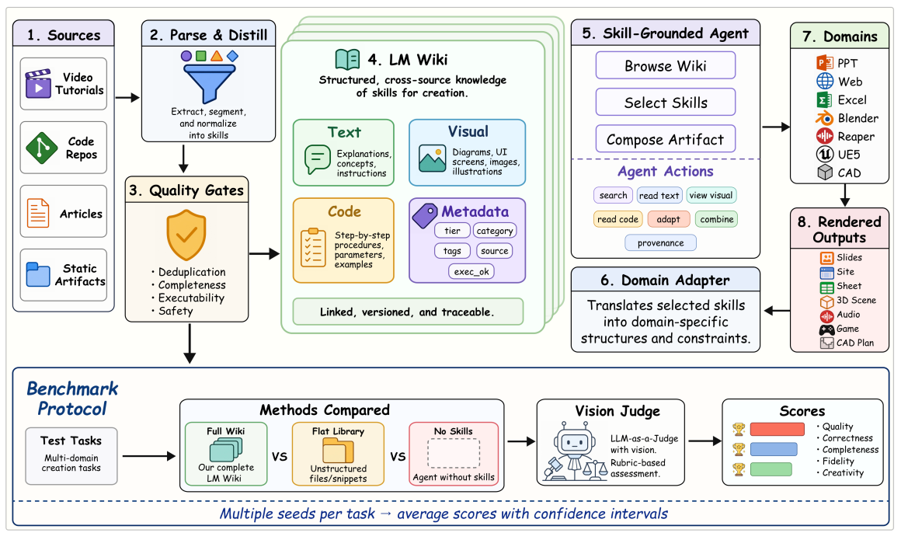
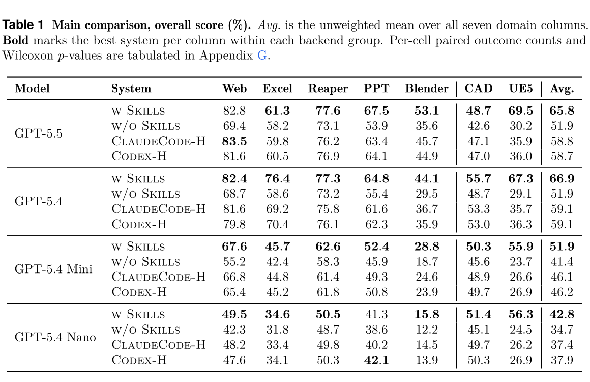
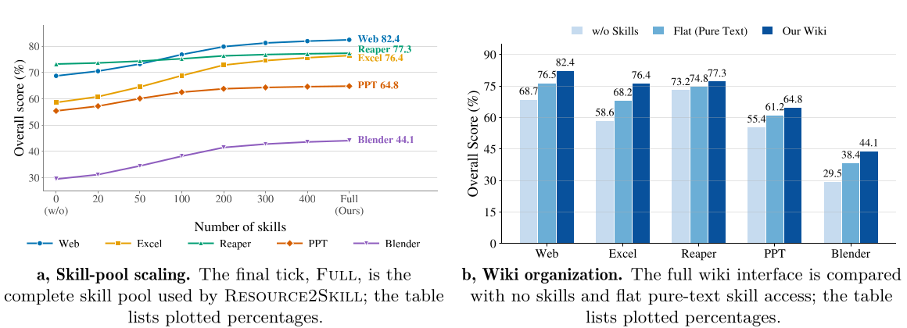
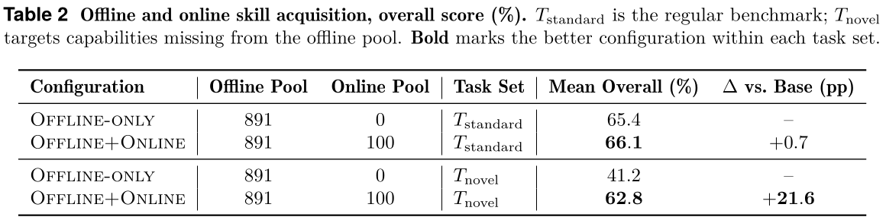
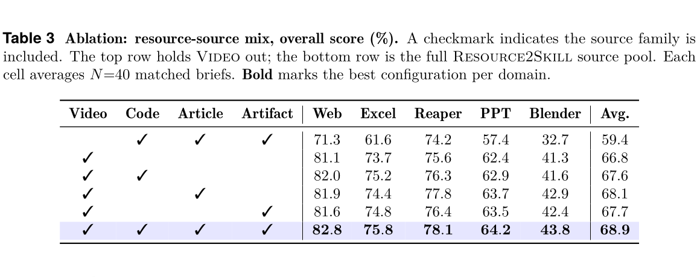
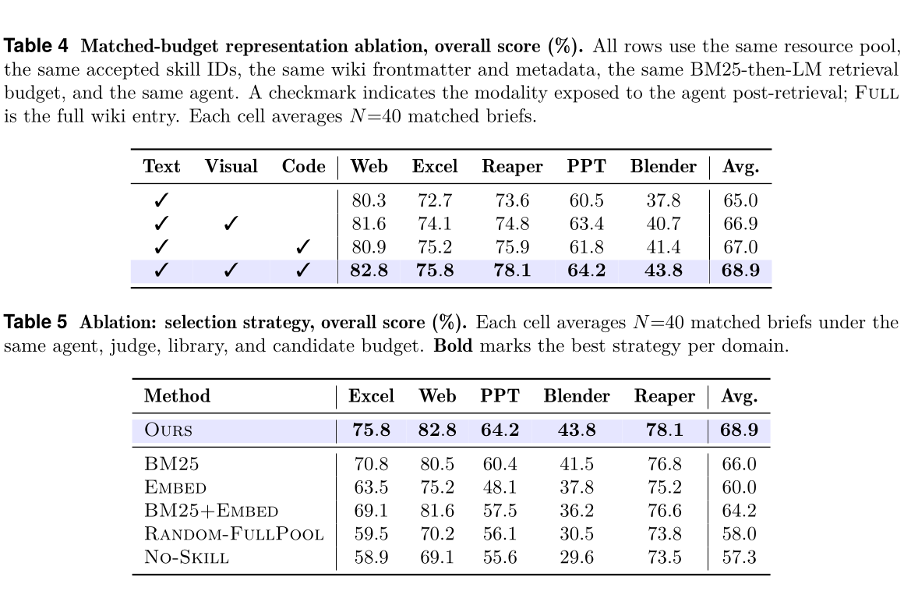

# Resource2Skill：从人类创作的多模态资源中蒸馏软件智能体的可执行技能

> **首轮双语精读稿（draft）**  
> 原文：*Resource2Skill: Distilling Executable Skills from Human-Created Resources for Software Agents*  
> 作者：Yijia Fan, Zonglin Di, Zimo Wen, Yifan Yang, Mingxi Cheng, Qi Dai, Bei Liu, Kai Qiu, Yue Dong, Ji Li, Chong Luo  
> 来源：arXiv:2606.29538v4，2026-07-17  
> 论文类型：方法 / 系统 / 实证研究  
> 本稿范围：完整覆盖摘要、核心问题、方法、主实验、关键消融、结论与局限性；参考文献及部分实现附录尚未逐段翻译，详见 `translation_notes.md`。

## 阅读导航

- [摘要与问题定义](#摘要与问题定义)
- [核心方案](#核心方案)
- [实验设计与主要结果](#实验设计与主要结果)
- [消融研究](#消融研究)
- [结论与局限性](#结论与局限性)
- [批判性阅读提示](#批判性阅读提示)

## 术语表

| Canonical term | 中文 | 首次使用 / 说明 | 文中变体与处理 |
|---|---|---|---|
| skill | 技能 | 可复用的程序性知识 | 固定译作“技能”，不与 capability 混用 |
| procedural knowledge | 程序性知识 | 关于如何分解、操作、检查和恢复的知识 | 不译成“流程知识” |
| Resource2Skill | Resource2Skill | 本文框架名 | 保留英文 |
| Skill Wiki | 技能 Wiki | 分层、多模态技能库 | wiki / library 依上下文区分 |
| construction operator | 构建算子 | 从资源抽取、规范化并验收技能的算子 | 记作 `(fθ, A_D)` |
| MetaBrowse | MetaBrowse | 分层检索后由语言模型选择技能的策略 | 保留英文 |
| offline acquisition | 离线获取 | 预先构建技能库 | 与 online acquisition 区分 |
| online acquisition | 在线获取 | 覆盖不足时临时补充技能 | 也称 online gap-filling |
| artifact | 产物 | 幻灯片、网页、表格、3D 场景、音频等最终输出 | 不译作“工件” |
| harness | 智能体运行框架 | ClaudeCode-H / Codex-H 的 `-H` 含义 | 不是 human rater |

## 摘要与问题定义

**Source:** p.1 S001

**Original:** Skills are a useful abstraction for software agents, turning human and agent experience into reusable procedural knowledge. Yet existing skill libraries are mostly hand-written, text-centric, or derived from agent traces, leaving tutorial videos and other multimodal human resources largely underused. We present Resource2Skill, a framework that distills multimodal resources—tutorial videos, repositories, articles, and reference artifacts—into executable skills for software agents. Resource2Skill organizes these skills as a hierarchical multimodal Skill Wiki, where each entry combines structured text, code, visual examples, metadata, and provenance. This design preserves complementary signals from different resources: videos capture temporal operations and visual effects, code captures executable tool patterns, and articles or artifacts provide conceptual and stylistic grounding. At inference time, agents retrieve and compose relevant skills from the wiki; when coverage is insufficient, the same construction operator can acquire new skills online. Across seven practical authoring domains, Resource2Skill improves average overall score by +11.9 percentage points over no-skill agents and outperforms strong harness baselines in 26 of 28 main-aggregate model–domain cells. Ablations confirm the value of multimodal skill format, hierarchical organization, source diversity, selection strategy, and online acquisition.

**中文:** 技能是软件智能体的一种有用抽象：它把人类和智能体的经验转化为可复用的程序性知识。然而，现有技能库大多由人工编写、以文本为中心，或从智能体轨迹中提取，因此教程视频及其他多模态人类资源仍未得到充分利用。本文提出 Resource2Skill，一个把教程视频、代码仓库、文章和参考产物等多模态资源蒸馏成软件智能体可执行技能的框架。Resource2Skill 将这些技能组织为分层的多模态技能 Wiki；每个条目同时包含结构化文本、代码、视觉示例、元数据和来源信息。该设计保留了不同资源的互补信号：视频呈现操作时序和视觉效果，代码提供可执行的工具使用模式，文章或参考产物则提供概念与风格依据。推理时，智能体从 Wiki 中检索并组合相关技能；若覆盖不足，同一个构建算子还可在线获取新技能。在七个实际创作领域中，Resource2Skill 相比无技能智能体把平均总体得分提高了 11.9 个百分点，并在 28 个“模型×领域”主聚合单元中的 26 个超过强运行框架基线。消融实验进一步验证了多模态技能格式、分层组织、来源多样性、选择策略和在线获取的价值。

**Source:** p.1 S002

**Original:** Large language model agents are increasingly expected to do more than answer questions: they must operate software, call tools, inspect intermediate results, and produce high-quality artifacts such as slide decks, spreadsheets, web pages, 3D scenes, CAD designs, and audio projects. In these settings, success often depends less on isolated factual knowledge than on reusable procedural know-how: how to decompose a goal, which tool or API pattern to use, what intermediate state to inspect, and how to recover when an operation fails. We refer to such reusable procedural knowledge as skills.

**中文:** 人们对大语言模型智能体的期待正逐渐超出“回答问题”：它们还必须操作软件、调用工具、检查中间结果，并制作高质量的幻灯片、电子表格、网页、3D 场景、CAD 设计和音频项目。在这些场景里，成功与否通常不太取决于孤立的事实知识，而更取决于可复用的程序性诀窍：如何拆解目标、选择哪种工具或 API 模式、检查什么中间状态，以及操作失败后如何恢复。本文把这类可复用的程序性知识称为“技能”。

**Source:** p.2 S003

**Original:** This observation motivates a broader question: Can we automatically distill skills from multimodal human-created resources, especially tutorial videos, and use them to build a scalable skill library for software agents? The answer is not straightforward. Although frontier models have seen massive amounts of text during pretraining, and text resources are routinely exploited through retrieval and search, high-dimensional multimodal resources remain much harder to use effectively at inference time. Directly placing raw videos into an agent’s memory is expensive, redundant, and often impractical. A single tutorial may contain minutes of irrelevant setup, repeated narration, and visual details that are important only at a few key moments. At the same time, compressing video into a plain text summary discards precisely the information that makes video useful: dynamic operations, before-after visual changes, animation quality, spatial layout, timing, and tool interaction order.

**中文:** 由此产生了一个更广泛的问题：我们能否从人类创作的多模态资源，尤其是教程视频中，自动蒸馏技能，并据此为软件智能体构建可扩展的技能库？答案并不简单。虽然前沿模型在预训练中见过海量文本，而且文本资源通常可通过检索和搜索加以利用，但高维多模态资源在推理阶段仍然更难被有效使用。把原始视频直接放进智能体记忆既昂贵又冗余，通常也不现实：一段教程可能包含数分钟无关的准备过程、重复讲解，以及仅在少数关键时刻才有价值的视觉细节。另一方面，把视频压缩成纯文本摘要，又会恰好丢掉视频最有用的信息：动态操作、前后视觉变化、动画质量、空间布局、时序和工具交互顺序。

**Source:** p.2 S004

**Original:** We introduce Resource2Skill, a framework for distilling executable skills from human-created resources and organizing them into a maintainable multimodal skill library for software agents. Given multimodal resources—including tutorial videos, source repositories, articles, documentation, and reference artifacts—Resource2Skill extracts domain-specific skills and stores them in a hierarchical Skill Wiki. Each skill is represented as a multimodal entry that may contain structured text, executable or adaptable code, visual examples, metadata, and provenance. This design makes the skill library more than a flat collection of retrieved passages: text explains applicability and mechanism, code provides tool-grounded execution patterns, and visual examples preserve layout, style, motion, and other perceptual information that text alone under-specifies.

**中文:** 本文提出 Resource2Skill：它从人类创作的资源中蒸馏可执行技能，并把这些技能组织成面向软件智能体、可维护的多模态技能库。面对教程视频、源代码仓库、文章、文档和参考产物等多模态资源，Resource2Skill 抽取领域特定技能，并将其存入分层的技能 Wiki。每项技能都表示为一个多模态条目，其中可以包含结构化文本、可执行或可改写的代码、视觉示例、元数据和来源信息。这样，技能库便不再只是检索段落的扁平集合：文本解释适用性和机制，代码提供以工具为基础的执行模式，视觉示例则保留仅靠文本难以充分说明的布局、风格、运动和其他感知信息。

### Fig. 1. Resource2Skill 的概览与代表性输出

**Placed near:** p.2 S004  
**Source:** p.2 C001

**Original caption:** Resource2Skill distills multimodal resources into a hierarchical Skill Wiki across seven creative software domains.

**中文图注:** Resource2Skill 在七个创作软件领域中，把多模态资源蒸馏为一个分层的技能 Wiki。

**Reading note:** 左侧比较“有技能/无技能”的代表性产物，右侧雷达图显示不同领域的提升并不均匀；UE5 和 Blender 等复杂软件领域受益更大。

**Source:** p.3 S005

**Original:** A central design choice of Resource2Skill is to treat skill construction and skill use as a unified pipeline. Offline, we distill large-scale resources into a domain wiki for important commercial software scenarios. At inference time, given a user requirement, the agent first navigates the hierarchical index to form a candidate skill pool, then reads the relevant multimodal entries and composes them during execution. Moreover, when the offline library does not cover a requested capability, the same resource-to-skill operator can be invoked online to search for new resources, extract additional skills, and incrementally extend the library. The resulting system is therefore not a fixed prompt collection, but a growing and maintainable procedural memory.

**中文:** Resource2Skill 的一个核心设计选择，是把技能构建和技能使用视为统一的流水线。离线阶段，系统从大规模资源中蒸馏出面向重要商业软件场景的领域 Wiki。推理阶段，给定用户需求，智能体先沿分层索引导航，形成候选技能池，再读取相关多模态条目，并在执行过程中组合它们。此外，当离线技能库无法覆盖所请求的能力时，同一个“资源到技能”算子可在线调用：搜索新资源、抽取额外技能，并增量扩展技能库。因此，最终系统不是固定的提示词集合，而是一套可以增长、可以维护的程序性记忆。

**Source:** p.3 S006

**Original:** We study Resource2Skill across seven practical software-authoring domains, including slide design, web page generation, spreadsheet authoring, Blender scene creation, CAD design, UE5 scene construction, and music production. Across our seven authoring benchmark suites, Resource2Skill improves the average overall score by +11.9 percentage points over the same agents without skills, and outperforms strong agentic-harness baselines in 26 of 28 main-aggregate cells. Ablations further show that the hierarchical wiki interface, source diversity, multimodal skill format, library scale, online skill acquisition, and hierarchy-then-LM selection strategy each contribute to the final performance.

**中文:** 作者在七个实际软件创作领域研究 Resource2Skill，包括幻灯片设计、网页生成、电子表格制作、Blender 场景创建、CAD 设计、UE5 场景构建和音乐制作。在七套创作基准上，Resource2Skill 相比相同但不使用技能的智能体，将平均总体得分提高了 11.9 个百分点，并在 28 个主聚合单元中的 26 个超过强智能体运行框架基线。进一步的消融实验表明，分层 Wiki 接口、来源多样性、多模态技能格式、技能库规模、在线技能获取，以及“先按层级缩小范围、再由语言模型选择”的策略，都会对最终性能作出贡献。

## 核心方案

**Source:** p.4 S007

**Original:** Voyager, AWM, ASI, and SkillFlow grow text- or code-only libraries online from a single domain’s agent traces or failures and retrieve by dense similarity or repair rules; Anthropic Agent Skills ships hand-authored text/code/asset bundles without automatic acquisition; SkillFoundry, closest in spirit, mines text/code skills offline into a top-down knowledge tree for scientific computing. Our work differs by combining offline-mined multimodal skills (videos, repositories, articles, reference artifacts), a hierarchical wiki interface with hierarchy-then-LM selection, artifact-level evaluation by vision and audio judges, and controlled online gap-filling, across seven authoring domains.

**中文:** Voyager、AWM、ASI 和 SkillFlow 从单一领域的智能体轨迹或失败中在线扩展仅含文本或代码的技能库，并通过稠密相似度或修复规则进行检索；Anthropic Agent Skills 提供人工编写的文本/代码/资产包，但不具备自动获取机制；与本文思路最接近的 SkillFoundry，则面向科学计算，离线挖掘文本/代码技能并组织成自顶向下的知识树。Resource2Skill 的区别在于：跨七个创作领域，同时结合离线挖掘的多模态技能（视频、代码仓库、文章、参考产物）、采用“层级导航后由语言模型选择”的分层 Wiki 接口、用视觉和音频裁判进行产物级评估，并进行受控的在线能力补缺。

### Fig. 2. Resource2Skill 系统流水线

**Placed near:** p.4 S008  
**Source:** p.4 C002

**Original caption:** Resource2Skill pipeline. A construction operator `(fθ, A_D)` distills resources into the hierarchical Skill Wiki; MetaBrowse retrieves candidates and the language model selects from text/visual/code views, applied through MCP to a domain backend. The same operator is reused online when the offline pool is insufficient.

**中文图注:** Resource2Skill 流水线。构建算子 `(fθ, A_D)` 把资源蒸馏到分层技能 Wiki；MetaBrowse 检索候选项，语言模型再依据文本、视觉和代码视图进行选择，并经由 MCP 应用于领域后端。当离线技能池不足时，系统在线复用同一构建算子。

**Reading note:** 这张图把论文真正的工程贡献拆成四件事：资源蒸馏、质量门控、Wiki 组织与检索、面向具体软件的执行适配。

**Source:** p.4 S008

**Original:** We instantiate Resource2Skill as four stages (Figure 2): construction, wiki organization, selection, and execution. The same construction operator is reused online when the offline pool is insufficient, so online acquisition adds no separate pipeline, and all four stages share a single MCP-mediated browse-select-execute interface over domain-specific backends.

**中文:** Resource2Skill 被实现为四个阶段（图 2）：构建、Wiki 组织、选择和执行。当离线技能池不足时，系统在线复用同一个构建算子，因此在线获取不需要额外的独立流水线；四个阶段都通过同一套由 MCP 中介的“浏览—选择—执行”接口来访问领域特定后端。

**Source:** pp.4–5 S009

**Original:** A skill is a tuple `s = (p, x_text, x_visual, x_code, m)`, where `p` is the path of `s` in a domain-specific taxonomy `T_D` and `m` is metadata used for filtering, auditing, and provenance. The three content views are complementary: `x_text` states name, mechanism, applicability, inputs, and expected effects; `x_visual` provides thumbnails, screenshots, rendered previews, or diagrams; `x_code` contains executable or adaptable procedure fragments. The taxonomy is domain-specific but the browse-and-read interface is shared.

**中文:** 一项技能被表示为五元组 `s = (p, x_text, x_visual, x_code, m)`。其中，`p` 是技能 `s` 在领域特定分类体系 `T_D` 中的路径，`m` 是用于筛选、审计和来源追踪的元数据。三种内容视图彼此互补：`x_text` 说明名称、机制、适用条件、输入和预期效果；`x_visual` 提供缩略图、截图、渲染预览或示意图；`x_code` 包含可执行或可改写的过程片段。分类体系因领域而异，但浏览和读取接口是共享的。

**Source:** p.5 S010

**Original:** A construction operator distills multimodal resources into wiki entries. The resource pool `R_D` for domain `D` is drawn from four families: tutorial videos, source repositories, articles, and reference artifacts. A multimodal distiller maps each resource `r ∈ R_D` to candidate skills, `s̃_1:k = fθ(r, D)`, each expressed in the wiki schema above. Concretely, `fθ` retrieves resources against domain-specific queries, extracts modality-specific evidence (key frames, code regions and parameter signatures, prose passages, rendered exemplars), distills it into `(p, x_text, x_visual, x_code, m)` via a vision-capable LM, and normalizes the result. A domain-specific predicate `A_D` then enforces five checks—completeness, traceable provenance, deduplication, modality consistency, and structural executability of the code field when present.

**中文:** 构建算子负责把多模态资源蒸馏成 Wiki 条目。领域 `D` 的资源池 `R_D` 来自四类来源：教程视频、源代码仓库、文章和参考产物。多模态蒸馏器把每个资源 `r ∈ R_D` 映射成候选技能 `s̃_1:k = fθ(r, D)`，并按前述 Wiki 模式表示。具体来说，`fθ` 先按领域特定查询检索资源，再抽取模态特定证据（关键帧、代码区域与参数签名、文本段落、渲染示例），随后通过具备视觉能力的语言模型把证据蒸馏成 `(p, x_text, x_visual, x_code, m)` 并规范化。最后，领域特定判定器 `A_D` 执行五项检查：完整性、可追踪来源、去重、模态一致性，以及在存在代码字段时检查其结构可执行性。

**Source:** pp.5–6 S011

**Original:** Given a brief `q`, the agent must choose a small subset of wiki entries to compose. MetaBrowse uses the wiki’s hierarchical organization in two stages: a lexical scorer narrows the candidate set to a topically relevant region of the taxonomy, then a language model selects a subset to compose. The first-stage score combines the entry’s name, tags, applicability text, and—critically—its taxonomy path `p(s)`, so the wiki tree directly favours skills sitting in topically relevant subtrees rather than treating the library as a flat list. The language model then reads structured evidence for candidates and selects a subset to compose. Selection is a subset rather than a ranking: the language model can pick zero skills if no candidate is a good fit.

**中文:** 给定任务简述 `q`，智能体需要选择一小组 Wiki 条目进行组合。MetaBrowse 分两阶段利用 Wiki 的分层组织：首先，词法评分器把候选集合缩小到分类体系中主题相关的区域；随后，语言模型从中选出要组合的子集。第一阶段评分综合条目名称、标签、适用性文本，以及至关重要的分类路径 `p(s)`。因此，Wiki 树会直接偏向处于相关子树中的技能，而不是把整个技能库当作扁平列表。之后，语言模型读取候选项的结构化证据并选择一个子集。这里的“选择”不是单纯排序：如果没有合适候选，语言模型可以一个技能也不选。

**Source:** p.6 S012

**Original:** The agent and domain adapter share one MCP tool surface. The wiki side exposes a small set of discovery actions (list categories, list skills with metadata cards, read per-modality content) together with a search action wrapping the BM25 shortlist; the domain side exposes a single apply action backed by a per-domain capabilities manifest, with structured not-applicable returns for missing capabilities. A run follows the same control loop in every domain (plan, MetaBrowse, apply, render), and selected skill code, when present, executes directly against the live MCP server with no language-model translation between selection and execution. When the candidate set contains no adequate skill, the same operator `(fθ, A_D)` is invoked online. Offline and online pools are kept separate throughout the experiments, so online acquisition is a controlled gap-filler on capability regions known to be insufficient, rather than uncontrolled context expansion at test time.

**中文:** 智能体与领域适配器共享同一个 MCP 工具表面。Wiki 一侧提供少量发现操作（列出分类、以元数据卡片列出技能、按模态读取内容），并提供一个封装 BM25 候选短名单的搜索操作；领域一侧则提供单一的 `apply` 操作，由每个领域的能力清单支撑，对缺失能力返回结构化的“不适用”结果。每个领域都遵循同一个控制循环：规划、MetaBrowse、应用、渲染。若选中的技能包含代码，这些代码会直接在实时 MCP 服务器上执行，选择和执行之间不再由语言模型进行二次翻译。当候选集合没有足够好的技能时，系统在线调用同一算子 `(fθ, A_D)`。整个实验始终把离线池和在线池分开，因此在线获取是针对已知覆盖不足区域的受控补缺，而不是测试时不加约束地扩张上下文。

## 实验设计与主要结果

**Source:** p.6 S013

**Original:** We evaluate on seven authoring domains: slide design (PPT), 2D drafting (CAD), web (HTML/CSS/JS), spreadsheet authoring (Excel), 3D scenes (Blender), real-time 3D (UE5), and audio production (Reaper). Each domain has a screened pool of 80 task briefs with no overlap with the resource corpora used to build the library; the brief author is blind to the wiki and the agent. The main comparison and the scaling and online/offline studies use a matched `N=80` subset per domain; ablations use matched `N=40` subsets. All conditions in a comparison share brief IDs, so within-table deltas are paired by construction.

**中文:** 评估覆盖七个创作领域：幻灯片设计（PPT）、二维制图（CAD）、网页（HTML/CSS/JS）、电子表格（Excel）、3D 场景（Blender）、实时 3D（UE5）和音频制作（Reaper）。每个领域都有一组经筛选的 80 个任务简述，且与用于构建技能库的资源语料不重叠；任务简述的作者不知道 Wiki 和智能体配置。主比较、规模研究以及在线/离线研究在每个领域采用匹配的 `N=80` 子集，消融实验采用匹配的 `N=40` 子集。一次比较中的所有条件共享相同任务 ID，因此表内差值天然构成配对比较。

**Source:** pp.6–7 S014

**Original:** We sweep four agent backends—GPT-5.5, GPT-5.4, GPT-5.4 Mini, and GPT-5.4 Nano—against four systems. `w Skills` is the full Resource2Skill pipeline. `w/o Skills` is the same agent solving tasks through free-form code over the domain apply tool, with no skill library. ClaudeCode-H and Codex-H are the off-the-shelf Claude Code and Codex agentic harnesses. Non-audio artifacts are judged by a GPT-5.4 vision judge; Reaper is judged by an audio-capable GPT-4o-series judge. The judge is blinded to the system label and sees only the brief and the rendered artifact. Each domain has its own five-axis rubric; rubric scores in 0–10 are reported as percentages, and the overall score is the unweighted arithmetic mean of the five axes. A run that fails to produce a scorable artifact is treated as a failure and folds in at overall=0.

**中文:** 实验把四种智能体后端——GPT-5.5、GPT-5.4、GPT-5.4 Mini 和 GPT-5.4 Nano——分别放入四种系统配置中比较。`w Skills` 是完整的 Resource2Skill 流水线；`w/o Skills` 使用相同智能体，但不接入技能库，只通过领域 `apply` 工具编写自由形式代码完成任务；ClaudeCode-H 和 Codex-H 则是现成的 Claude Code 与 Codex 智能体运行框架。非音频产物由 GPT-5.4 视觉裁判评分，Reaper 产物由具备音频能力的 GPT-4o 系列裁判评分。裁判不知道系统标签，只看到任务简述和渲染产物。每个领域都有自己的五维评分量表；0–10 分被换算为百分比，总体分数是五个维度的无权算术平均。若一次运行未产生可评分产物，则记为失败，总体分计为 0。

### Table 1. 主比较：七领域总体得分

**Placed near:** p.7 S015  
**Source:** p.7 C003

**Original caption:** Main comparison, overall score (%). Avg. is the unweighted mean over all seven domain columns. Bold marks the best system per column within each backend group. Per-cell paired outcome counts and Wilcoxon p-values are tabulated in Appendix G.

**中文图注:** 主比较的总体得分（%）。Avg. 是七个领域列的无权平均；粗体表示每组智能体后端中每一列的最佳系统。每个单元的配对结果计数与 Wilcoxon `p` 值见附录 G。

**Reading note:** 先按后端横向比较 `w Skills` 与 `w/o Skills`，再看 Resource2Skill 与两种 harness 的差距。最大、最稳定的提升集中在 UE5、Blender 和 Web。

**Source:** p.7 S015

**Original:** The first question is whether the skill library contributes measurable lift. We compare the four systems on the matched-brief suite of `N=80` tasks per domain, repeated across the four agent backends. The judge, brief set, and decoding seed are held fixed within each model-domain cell, so score differences isolate the effect of the execution interface and skill access.

**中文:** 第一个问题是技能库是否带来可测量的提升。作者在每个领域 `N=80` 个匹配任务上比较四种系统，并在四种智能体后端上重复实验。每个“模型×领域”单元内固定裁判、任务集合和解码随机种子，因此分数差异被解释为执行接口与技能访问所产生的效果。

**Source:** p.7 S016

**Original:** `w Skills` beats `w/o Skills` in all 28 main-aggregate model–domain cells, averaging 56.8% versus 45.0%, a +11.9-point lift. Both off-the-shelf harnesses raise the no-skill agent on their own but remain consistently below `w Skills`: Codex-H reaches 50.5% and ClaudeCode-H 50.4% on the same matched briefs, and `w Skills` still beats the stronger of the two in 26 of 28 cells. The two exceptions are within one point. In the reported paired cells, deltas of `w Skills` over `w/o Skills` are statistically significant (paired Wilcoxon `p < 10^-3`).

**中文:** `w Skills` 在全部 28 个主聚合“模型×领域”单元中都超过 `w/o Skills`，平均得分分别为 56.8% 和 45.0%，提升 11.9 个百分点。两种现成运行框架本身也能改善无技能智能体，但始终整体落后于 `w Skills`：在相同匹配任务上，Codex-H 为 50.5%，ClaudeCode-H 为 50.4%；`w Skills` 在 28 个单元中的 26 个仍超过两者中更强的一个。两个例外的差距都不到 1 分。在论文报告的配对单元中，`w Skills` 相对 `w/o Skills` 的差异具有统计显著性（配对 Wilcoxon `p < 10^-3`）。

**Source:** p.7 S017

**Original:** Per-domain gains are largest where authoring conventions are dense and expensive to re-derive from a prompt—Blender, Web, and UE5 at the larger backends—and largest of all on UE5 (+30 to +40 pp), where the free-form code agent rarely assembles a minimum-viable scene through the UE5 Python API and frequently returns artifacts below the per-domain minimum-quality threshold. Reaper sees the smallest gains, reflecting a relatively competent no-skill prior over the medium. A blinded human A/B study with five raters per pair on 40 matched pairs across all seven domains corroborates the preference direction across all seven domains, with `w Skills` winning 85.5% of non-tied individual ratings against `w/o Skills`.

**中文:** 当创作规范密集、难以仅从提示词重新推导时，领域提升最大；在较大后端上，典型领域是 Blender、Web 和 UE5。其中 UE5 的提升最大，达到 30–40 个百分点：自由编程智能体很少能通过 UE5 Python API 组装出最低可用场景，而且经常返回低于该领域最低质量阈值的产物。Reaper 的增益最小，说明模型在该媒介上即使不使用技能也已有较强先验。作者还对七个领域的 40 组匹配样本进行了盲测人类 A/B 研究，每组由五位评分者判断；在排除平局的单次评分中，`w Skills` 对 `w/o Skills` 的胜率为 85.5%，七个领域的偏好方向一致。

### Fig. 3. 技能库规模与 Wiki 组织方式

**Placed near:** p.8 S018  
**Source:** p.8 C004

**Original caption:** (a) Skill-pool scaling. The final tick, Full, is the complete skill pool used by Resource2Skill. (b) Wiki organization. The full wiki interface is compared with no skills and flat pure-text skill access.

**中文图注:** (a) 技能池规模扩展；最后的 Full 表示 Resource2Skill 使用的完整技能池。(b) Wiki 组织方式；比较完整 Wiki 接口、无技能以及扁平纯文本技能访问。

**Reading note:** 左图支持“前 200 项技能贡献最大、之后边际收益递减”；右图表明纯文本技能已有效，但分层、代码和视觉信息还能继续提升。

**Source:** p.8 S018

**Original:** Performance rises monotonically with library size in every domain and saturates near 200 skills. The first `0 → 200` slice carries the largest gains (between +3.1 pp on Reaper and +14.2 pp on Excel); the curve flattens after 200 and the `400 → Full` step adds at most +0.8 pp per domain. Early entries cover common operations and recovery routines; later entries fill domain-specific gaps.

**中文:** 所有领域的性能都随技能库规模单调上升，并在约 200 项技能附近趋于饱和。`0 → 200` 这一段带来最大增益：Reaper 为 +3.1 个百分点，Excel 为 +14.2 个百分点；超过 200 后曲线变平，从 `400 → Full` 每个领域至多再增加 0.8 个百分点。较早加入的条目覆盖常见操作与恢复流程，后续条目主要填补领域特定空缺。

### Table 2. 离线与在线技能获取

**Placed near:** p.8 S019  
**Source:** p.8 C005

**Original caption:** Offline and online skill acquisition, overall score (%). `T_standard` is the regular benchmark; `T_novel` targets capabilities missing from the offline pool.

**中文图注:** 离线与在线技能获取的总体得分（%）。`T_standard` 是常规基准；`T_novel` 专门测试离线技能池缺失的能力。

**Reading note:** 在线获取对常规任务只增加 0.7 分，但对预先确认的覆盖缺口增加 21.6 分。这个实验支持“补缺”，不支持“在线搜索总是更好”。

**Source:** p.8 S019

**Original:** The two task sets reveal a sharp asymmetry. On `T_standard`, online acquisition adds +0.7 pp—essentially noise, since the offline pool already covers most common requests. On `T_novel`, the same 100 online skills lift the mean score from 41.2% to 62.8% (+21.6 pp). Online search is a gap-filler, not a booster; we therefore default to Offline-only for the standard benchmark.

**中文:** 两个任务集合呈现出明显的不对称。在 `T_standard` 上，在线获取仅增加 0.7 个百分点，基本可视为噪声，因为离线技能池已覆盖大多数常见请求。在 `T_novel` 上，同样的 100 项在线技能把平均分从 41.2% 提高到 62.8%，增加 21.6 个百分点。在线搜索的作用是补缺而不是普遍增益，因此常规基准默认只使用离线技能池。

## 消融研究

### Table 3. 资源来源组合消融

**Placed near:** p.9 S020  
**Source:** p.9 C006

**Original caption:** Ablation: resource-source mix, overall score (%). A checkmark indicates the source family is included. The top row holds Video out; the bottom row is the full Resource2Skill source pool.

**中文图注:** 资源来源组合的总体得分消融（%）。勾选表示包含该类来源；第一行排除视频，最后一行使用完整 Resource2Skill 来源池。

**Reading note:** 这里最强的证据不是“来源越多越好”，而是“视频不可轻易被其余三类来源替代”；完整来源池的额外增益相对较小。

**Source:** p.9 S020

**Original:** Video is the non-substitutable source. Holding it out drops the average from 68.9% to 59.4%, and the video-only library still outscores the three-source no-video library by 7.4 points. The video-removal drop concentrates where temporal operations and visual sequencing carry signal that text under-specifies (Excel −14.2 pp, Web −11.5 pp). Beyond video, no supplemental family dominates, but the all-source pool stays 0.3 to 0.9 pp ahead of the strongest two-source variant in every domain; diversity adds coverage insurance on top of video.

**中文:** 视频是不可替代的来源。移除视频后，平均分从 68.9% 降至 59.4%；仅使用视频的技能库仍比“代码+文章+参考产物、但无视频”的三来源技能库高 7.4 分。去除视频造成的下降主要集中在依赖时间操作与视觉顺序、而文本描述不足的领域：Excel 下降 14.2 个百分点，Web 下降 11.5 个百分点。除视频外，没有哪一种补充来源占据绝对优势；不过，在每个领域，完整来源池仍比最强的双来源配置高 0.3–0.9 个百分点。因此，多样性在视频基础上提供的是覆盖保险。

### Tables 4–5. 表示形式与选择策略消融

**Placed near:** pp.9–10 S021  
**Source:** p.10 C007–C008

**Original caption:** Table 4: Matched-budget representation ablation, overall score (%). Table 5: Ablation of selection strategy, overall score (%).

**中文图注:** 表 4：匹配预算下的技能表示形式消融，总体得分（%）。表 5：技能选择策略消融，总体得分（%）。

**Reading note:** 表 4 试图把“多模态内容”与“已经过人工/模型整理的文本记忆”分开；表 5 则显示选择质量本身很重要，稠密向量检索并没有自动胜过 BM25。

**Source:** p.9 S021

**Original:** Text reaches 65.0% because it already inherits applicability and routing cues. Visuals add +1.9 pp, code adds +2.0 pp, and Full ranks first in every domain at 68.9%, attributing the remaining gain to multimodal skill content rather than curated memory alone.

**中文:** 纯文本配置达到 65.0%，因为它已经继承了适用性与路由线索。在此基础上，视觉信息增加 1.9 个百分点，代码增加 2.0 个百分点；完整配置以 68.9% 在每个领域都排名第一。这说明剩余增益来自多模态技能内容，而不只是经过整理的文本记忆。

**Source:** p.10 S022

**Original:** The hierarchy-then-LM MetaBrowse policy wins in every domain, averaging 68.9% against 66.0% for BM25, 64.2% for BM25+Embed, 60.0% for Embed, 58.0% for Random-FullPool, and 57.3% for No-Skill. Its largest margins over the strongest retrieval-only baseline are on Excel (+5.0 pp), PPT (+3.8), and Blender (+2.3), where task fit and complementarity are not captured by lexical or vector similarity alone.

**中文:** “先按层级缩小范围、再由语言模型选择”的 MetaBrowse 策略在所有领域获胜，平均分为 68.9%；相比之下，BM25 为 66.0%，BM25+Embed 为 64.2%，Embed 为 60.0%，Random-FullPool 为 58.0%，No-Skill 为 57.3%。相对最强的纯检索基线，该策略在 Excel（+5.0 个百分点）、PPT（+3.8）和 Blender（+2.3）上的优势最大；这些领域的任务适配与技能互补性无法仅靠词法或向量相似度捕获。

## 结论与局限性

**Source:** p.10 S023

**Original:** Resource2Skill distills multimodal human references into a structured, executable Skill Wiki shared by offline construction and controlled online gap filling. Across seven authoring domains and four backends, skill access improves artifact quality by +11.9 points over no-skill agents and beats two agentic-harness baselines in 26 of 28 main-aggregate cells. Our results show that distilling skills from human-created resources gives software agents reusable procedural knowledge that improves over both no-skill agents and strong agentic harnesses across diverse authoring domains.

**中文:** Resource2Skill 把多模态人类参考资料蒸馏成结构化、可执行的技能 Wiki，并由离线构建与受控在线补缺共同使用。在七个创作领域和四种后端上，技能访问相对无技能智能体把产物质量提高了 11.9 分，并在 28 个主聚合单元中的 26 个超过两种智能体运行框架基线。实验结果表明，从人类创作资源中蒸馏技能，可以为软件智能体提供可复用的程序性知识，并在多种创作领域中优于无技能智能体和强智能体运行框架。

**Source:** pp.21–22 S024

**Original:** Online acquisition is activated only when the offline wiki fails to return an adequate candidate set for the requested capability. In the offline/online study, the offline pool is fixed at launch and the online arm is allowed to add at most 100 newly searched and distilled skills. Online candidates use the same construction predicate as offline candidates: the entry must have sufficient text evidence, traceable provenance, non-duplicate metadata, and a valid modality bundle. If executable code is present, it must pass the domain’s smoke check or be marked as reference-only. Online entries are stored in a separate pool for the duration of the evaluation split and are not folded back into the offline wiki.

**中文:** 只有当离线 Wiki 无法为所请求能力返回足够好的候选集合时，系统才启用在线获取。在离线/在线研究中，离线池在启动时固定，在线分支最多允许增加 100 项新搜索并蒸馏的技能。在线候选与离线候选使用相同构建判定条件：条目必须具有充分的文本证据、可追踪来源、不重复的元数据和有效的模态包；若包含可执行代码，则必须通过相应领域的冒烟测试，否则标记为仅供参考。在线条目在整个评估划分期间存放在独立池中，不会合并回离线 Wiki。

**Source:** p.29 S025

**Original:** Across the five failure cases, two recurring patterns emerge: (i) partial grounding, where a skill is selected and its surface pattern is borrowed but key bindings or parameters do not resolve in the final artifact; and (ii) conservative composition, where the skill arm sticks closer to a single pattern and loses the variation a less-anchored agent would have introduced. A skill is only as useful as the agent’s ability to bind its parameters, and stronger selection narrows this binding cost.

**中文:** 五个失败案例呈现出两种反复出现的模式。第一是“部分落地”：系统选中了技能，也借用了其表层模式，但关键绑定或参数没有在最终产物中正确解析。第二是“保守组合”：技能分支过于贴近单一模式，失去了约束较少的智能体可能引入的变化。技能是否有用，取决于智能体能否正确绑定其参数；更强的选择策略可以降低这种绑定成本。

**Source:** p.30 S026

**Original:** We validate the main comparison with a blinded human A/B study. Artifact pairs are sampled from Section 4.2 balanced across the seven domains, and five human raters per pair view anonymized renderings side by side and choose the better artifact or declare a tie. Inter-rater agreement is Krippendorff’s `α = 0.58`. `w Skills` wins 136 of 200 individual ratings (68.0%), with 41 ties (20.5%) and 23 `w/o Skills` wins (11.5%); excluding ties, `w Skills`’s win rate is 85.5%.

**中文:** 作者用一项盲测人类 A/B 研究验证主比较。产物对从第 4.2 节抽样，并在七个领域之间保持平衡；每对由五位人类评分者并排查看匿名渲染结果，选择更好的产物或判定平局。评分者间一致性为 Krippendorff `α = 0.58`。在 200 次单独评分中，`w Skills` 获胜 136 次（68.0%），平局 41 次（20.5%），`w/o Skills` 获胜 23 次（11.5%）；排除平局后，`w Skills` 的胜率为 85.5%。

**Source:** pp.30–31 S027

**Original:** Most scores route through GPT-5.4 vision on rendered artifacts (Reaper through an audio-capable GPT-4o-series judge); judge–human agreement on the 17-task subsample is acceptable, and a blinded human A/B study independently corroborates the preference direction reported in the main comparison. We do not claim generalization to domains lacking either a programmatic tool interface or a public stream of procedural content. Online acquisition adds search, distillation, and validation latency on top of the normal benchmark pass. Our retrieval-style baselines operate over the distilled skill library, not over the raw resource corpus under a matched token budget. We leave a same-budget raw-resource retrieval comparison to future work.

**中文:** 大多数分数来自 GPT-5.4 视觉模型对渲染产物的评判（Reaper 使用具备音频能力的 GPT-4o 系列裁判）；在 17 个任务子样本上，自动裁判与人类的一致性可接受，独立的盲测人类 A/B 研究也支持主比较中的偏好方向。作者并不声称该方法能泛化到缺少可编程工具接口，或缺少公开程序性内容来源的领域。在线获取还会在常规基准流程之外增加搜索、蒸馏与验证延迟。此外，论文中的检索式基线是在已蒸馏技能库上运行，而不是在匹配 token 预算下直接检索原始资源语料；同预算的原始资源检索比较被留作未来工作。

## 批判性阅读提示

以下是基于上述原文的阅读判断，而不是作者的直接结论：

1. **最可信的结论是“结构化技能库能改善复杂软件创作”，不是“多模态技能必然带来 11.9 分”。** 11.9 分把技能内容、分层接口、执行方式和质量门控的整体效果合在一起；表 4 才较接近隔离多模态表示本身，其增益约为 3.9 分（65.0 → 68.9）。
2. **视频的重要性证据较强，但仍可能与资源数量、质量和领域适配耦合。** 作者做了来源消融，并显示无视频显著下降；要把结论推广成“视频一般优于文档”，还需更严格的等量、等质量资源对照。
3. **自动裁判是主要测量瓶颈。** 人类 A/B 结果支持方向，但样本量只有 200 次个体投票，且评分者间一致性 `α = 0.58` 只是中等水平；这足以佐证趋势，但不足以完全校准所有分数差。
4. **在线获取实验有意针对已知覆盖缺口。** `T_novel` 上的 +21.6 分说明在线补缺在这种设定下有效，但不能推断自然分布中的触发频率、延迟成本和净收益。
5. **一个关键缺失基线是“直接检索原始资源”。** 作者自己在局限性中承认，没有在匹配 token 预算下把技能蒸馏与原始视频转录、仓库片段和文章检索进行比较。因此，尚不能完全区分增益究竟来自“蒸馏成技能”，还是来自更优质、更丰富的外部上下文。

## 一句话抓住论文

Resource2Skill 的真正主张不是“给智能体多写一些提示词”，而是把人类教程中的操作时序、代码模式和视觉效果整理成可检索、可组合、可执行、可追踪的长期程序性记忆；实验表明，这种记忆在复杂创作软件中尤其有价值，但其测量仍高度依赖模型裁判，且尚缺少与原始资源直接检索的等预算对照。
